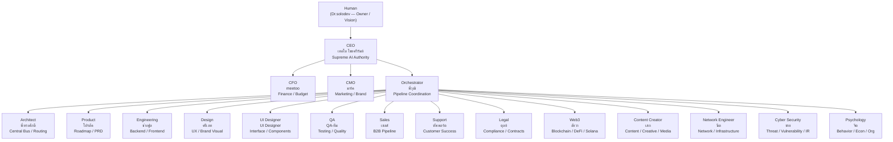

```text
================================================================================
  ███████  ██████  ██      ██████  ██████  ██████  ██████  ██████  ██████
  ██      ██    ██ ██      ██   ██ ██   ██ ██   ██ ██   ██ ██   ██      ██
  ███████ ██    ██ ██      ██████  ██████  ██████  ██████  ██████   █████
       ██ ██    ██ ██      ██   ██ ██      ██   ██ ██   ██ ██           ██
  ███████  ██████  ███████ ██   ██ ██      ██   ██ ██   ██ ██      ██████

   ██████  ██████
  ██      ██    ██
   █████  ██    ██
       ██ ██    ██
  ██████   ██████
================================================================================
                     OPERATING SYSTEM  ===  VERSION 2.4
================================================================================
```

# SoloCorp OS


> **Department Architecture for AI Agents** — transform a single AI into a coordinated workforce of 15 specialized departments, each with its own Head, specialist team, and clear chain of command.

---

## What is SoloCorp OS?

SoloCorp OS is an **organizational operating system for AI agents** — a complete Department Architecture that gives every unit of work an owner, a specialist executor, and a defined handoff path.

Instead of a monolithic AI trying to do everything, SoloCorp OS gives you:

- **18 Departments** — Each with a dedicated Head who owns outcomes, not just tasks
- **55+ Specialist Agents** — Sub-agents who execute; Heads who lead
- **Two-Tier Architecture** — Control flows Head-to-Head; data flows autonomously through a Central Bus
- **Clear Chain of Command** — Human → CEO → C-Level → Department Heads → Specialist Teams

The design is inspired by how real companies scale: clear hierarchy, delegated authority, and autonomous execution at every level. No orphan work. No ambiguous ownership.

---

## The Problem We Solve

Monolithic AI agents break down as complexity grows:

- **Context collapse** — a single AI context juggling 15 concerns loses depth; there is no specialist ownership, so output stays shallow and generic
- **No accountability chain** — when one prompt does everything, there is no clear owner when work goes wrong or falls through the cracks
- **Throughput ceiling** — every request bottlenecks through one context window; parallel workstreams are impossible by design
- **Implicit handoffs** — coordination between concerns is unstructured, so work gets lost, duplicated, or silently dropped between steps

SoloCorp OS replaces that single point of failure with a structured department hierarchy — each unit of work has a named owner, a specialist executor, and an explicit handoff path through the Central Bus.

---

## Key Features

| Feature | Description |
|:--------|:------------|
| **Ownership Model** | Every department has a Head who owns outcomes — not an employee, but an owner |
| **Delegation by Design** | Department Heads do not implement — they direct, escalate, and hand off to specialists |
| **Two-Tier Architecture** | Control layer (status, approvals, handoffs) is separate from data layer (code, designs, reports) |
| **Central Bus** | Async-first message routing between departments via a shared queue system |
| **Head-to-Head Handoff** | Work moves between departments without bottlenecking on a single orchestrator |
| **93 Skills** | Integration skills across all departments — symlinked to the Hermes skill library |
| **20 OpenCode Agents** | 15 department heads + 5 architect pipeline specialists, all `@mention`-ready |
| **Codex CLI Export** | All profiles exportable as Codex CLI custom sub-agents via `export-codex-agents.py` |
| **xGov Governance** | RFC → ADR → Guard Gates protocol with a 3-question complexity matrix |
| **Loop Runner** | Cron auto-pilot — scheduled pipeline execution every 30 minutes |

---

## Architecture



**Two-Tier Architecture**

```
CONTROL LAYER (Head-to-Head)
  Status · Goals · Exceptions · Approvals · Handoffs
  Head A ──(status/report)──→ Head B

DATA LAYER (Autonomous)
  Code · Designs · Reports · Raw Outputs
  Specialist A ──(write)──→ CENTRAL BUS ──(notify)──→ Specialist B
                                 └── Queue
```

---

## Quick Start

```bash
# 1. Clone and enter the repository
git clone https://github.com/Dr-SoloDev/Lab-solocorp-os2.4.git
cd Lab-solocorp-os2.4

# 2. Open with OpenCode (recommended) — routes to CEO by default
opencode

# 3. @mention a department head directly
opencode "@architect-songsak design pipeline for new feature"
opencode "@changful implement API endpoint for user registration"
opencode "@cfo-meetoo วิเคราะห์งบ Q3"

# 4. Export and use all profiles as Codex CLI sub-agents
python3 scripts/export-codex-agents.py
codex

# 5. Run the full pipeline for a feature
opencode "/pipeline <feature-name>"

# 6. Check system status
opencode "/status"
```

**Built-in Pipeline Commands**

| Command | Action |
|:--------|:-------|
| `/pipeline <feature>` | Run SoloCorp full cycle |
| `/handoff <from> <to> <task>` | Structured department handoff |
| `/status` | View pipeline health |
| `/audit [scope]` | Inspect audit trail |
| `/deploy` | Deploy profiles and config |
| `/brain <context>` | Save session to brain memory |

---

## The Team

### C-Level Executives

| # | Role | Name | Responsibility | Specialists |
|:-:|:-----|:-----|:--------------|:-----------:|
| 01 | CEO | เทอโบ (Turbo Chaisriram) | Vision, Strategy, Final Decision | — |
| 02 | CFO | meetoo | Finance, Budget, Investment | Dana · Riley · Morgan |
| 03 | CMO | มาร์ค (Mark) | Marketing, Content, Brand | Growth Hacker · Social Media · Content Creator |

### System Pipeline

| # | Role | Name | Responsibility | Specialists |
|:-:|:-----|:-----|:--------------|:-----------:|
| 04 | Orchestrator | พี่วุฒิ (Wut) | Cross-Department Pipeline Coordination | Project Shepherd · Studio Producer · Studio Operations |
| 05 | Architect | พี่ทรงศักดิ์ (Songsak) | Central Bus, Routing, Monitoring | Pipeline Auditor · Routing Config · Monitor Watchdog · Exception Triage · Cron Pipeline |

### Product & Engineering

| # | Role | Name | Responsibility | Specialists |
|:-:|:-----|:-----|:--------------|:-----------:|
| 06 | Product | โปรดัค (Produck) | Feature Roadmap, PRD, Delivery | Product Manager · Feedback Synthesizer · Sprint Prioritizer |
| 07 | Engineering | ช่างฟูล (Changful) | Backend, Frontend, Architecture | Backend Architect · Senior Dev · Software Architect |
| 08 | Design | ครีเอท (Kreet) | UX Research, Brand Visual | UX Researcher · UX Architect · UI Designer |
| 09 | UI Designer | UI Designer | Interface, Component Library | UI Designer · UX Architect · UX Researcher |

### Quality & Testing

| # | Role | Name | Responsibility | Specialists |
|:-:|:-----|:-----|:--------------|:-----------:|
| 10 | QA | QA-ทีม (QA Team) | Testing, Quality, Evidence | API Tester · Accessibility Auditor · Test Results Analyzer |

### Revenue & Customer

| # | Role | Name | Responsibility | Specialists |
|:-:|:-----|:-----|:--------------|:-----------:|
| 11 | Sales | เซลส์ (Sales) | B2B Deal Strategy, Pipeline | Deal Strategist · Pipeline Analyst · Outbound Strategist |
| 12 | Support | ซัพพอร์ต (Support) | Customer Success, Analytics | Support Responder · Analytics Reporter · Executive Summary Generator |

### Legal, Blockchain & Content

| # | Role | Name | Responsibility | Specialists |
|:-:|:-----|:-----|:--------------|:-----------:|
| 13 | Legal | ตุลย์ (Tul) | Compliance, Contracts, Law | Compliance Auditor · Legal Doc Review · Client Intake |
| 14 | Web3 | อัยวา (Aywa) | Blockchain, DeFi, Solana | Smart Contract Engineer · Security Auditor · DeFi Analyst · Solana Developer |
| 15 | Content Creator | เสก (Sek) | Content, Creative, Media | 10 specialist profiles (LinkedIn · TikTok · Instagram · YouTube · Reddit) |
| 16 | Network Engineer | นีต (Neet) | Network Design, Infrastructure, CDN, VPN | Network Architect · Infrastructure Engineer · Network Ops |
| 17 | Cyber Security | ซาย (Sai) | Threat Detection, Vulnerability, Incident Response | Threat Analyst · Vulnerability Assessor · Incident Responder |
| 18 | Psychology | จิต (Jit) | User Behavior, Behavioral Economics, Org Psychology | User Behavior Analyst · Behavioral Economist · Org Psychologist |

**Total: 18 Department Heads · 55+ Specialist Agents · 68+ Active Members**

---

## Development Status

| Phase | Content | Version | Status |
|:------|:--------|:-------:|:------:|
| Foundation | ADRs + CEO Profile + Architecture | v0.1–v0.2 | Complete |
| Pipeline Agents | Architect team — 5 pipeline agents | v0.3 | Complete |
| Department Profiles | 18 Department Heads + Teams | v0.5 | Complete |
| Deploy to Hermes | All profiles deployed to Hermes | v0.5.1 | Complete |
| Sub-agent Teams | 42 specialist agents deployed | v0.6.1 | Complete |
| Central Bus | FastAPI daemon + SQLite WAL + Guard + AAR | v0.6 | Complete |
| Multi-Platform Support | Hermes · OpenCode · Claude Code · Codex CLI | v0.7 | In Progress |
| Dashboard + Compliance | Pipeline Dashboard + Audit trail (Legal/CFO) | v0.7 | Planned |
| Public Launch | GTM · Content Campaign · Skill Docs | v0.7 | In Progress |
| Loop Runner | Cron auto-pilot — every 30 min | v0.5+ | Active |

**Overall Progress**

```
Foundation      ████████████████████ 100%
Profiles        ████████████████████ 100%
Sub-Agents      ████████████████████ 100%
Central Bus     ████████████████████ 100%
Multi-Platform  ████████░░░░░░░░░░░░  40%
Public Launch   ████████░░░░░░░░░░░░  40%
Dashboard       ███████░░░░░░░░░░░░░  35%
```

---

## Get Started

The fastest path to a working multi-agent team:

1. Clone the repo and open with `opencode`
2. Start a conversation — the CEO (เทอโบ) routes your request to the right department
3. Use `@mention` to reach a Head directly for specific work
4. Run `/pipeline <feature>` for a full cross-department cycle

**Reference docs:**

- `profiles/INDEX.md` — Index of all 15 department profiles and specialist teams
- `ARCHITECTURE.md` — System design, principles, and flow
- `PROJECT.md` — Getting started guide for newcomers
- `CHANGELOG.md` — Version history and release notes
- `decisions/` — Architecture Decision Records (ADRs)
- `dist/codex/README-CODEX-CLI.md` — Codex CLI export guide

---

<div align="center">

**SoloCorp OS — System First, Everything Follows**

Proprietary software &copy; SoloCorp Organization. All Rights Reserved.<br/>
Built by Dr.SoloDev &amp; เทอโบ ไชยศรีรัมย์

</div>
