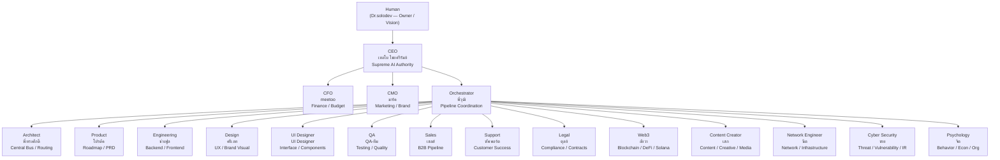

<!--
  SoloCorp OS — README
  Designed: 2026-07-07 | UX Funnel: Hook → Try it → Proof → Details
-->

<details>
<summary><strong>SoloCorp OS 2.4</strong> — ASCII banner (click to expand)</summary>

```text
================================================================================
  ███████  ██████  ██       ██████   ██████  ██████  ██████  ██████  
  ██      ██    ██ ██      ██    ██ ██      ██    ██ ██   ██ ██   ██ 
  ███████ ██    ██ ██      ██    ██ ██      ██    ██ ██████  ██████  
       ██ ██    ██ ██      ██    ██ ██      ██    ██ ██   ██ ██      
  ███████  ██████  ███████  ██████   ██████  ██████  ██   ██ ██      

   ██████  ███████  ███████   ██   ██
  ██    ██ ██            ██   ██   ██
  ██    ██ ███████  ███████ █ ███████
  ██    ██      ██  ██      █      ██
   ██████  ███████  ███████        ██
================================================================================
                     OPERATING SYSTEM  ===  VERSION 2.4
================================================================================
```

</details>

# SoloCorp OS

**Department Architecture for AI Agents** — transform a single AI into a coordinated workforce of 18 specialized departments, each with its own Head, specialist team, and clear chain of command.

<!-- Badges: grouped by category for visual hierarchy -->

**Status:**
[](https://github.com/Dr-SoloDev/Lab-solocorp-os2.4/releases/tag/v2.4.0-pre)
[](https://github.com/Dr-SoloDev/Lab-solocorp-os2.4/releases)
[](https://github.com/Dr-SoloDev/Lab-solocorp-os2.4/actions/workflows/copilot-setup-steps.yml)
[](LEGAL.md)

**Scale:**
[](profiles/INDEX.md)
[](profiles/INDEX.md)
[](profiles/INDEX.md)

**Platform:**
[](#product-packs)
[](https://github.com/Dr-SoloDev/Lab-solocorp-os2.4)
[](docs/GROK-SUPPORT.md)

> **License:** Proprietary — free for personal and educational use. See [LEGAL.md](LEGAL.md) for details.

---

## Try it in 30 seconds

```bash
git clone https://github.com/Dr-SoloDev/Lab-solocorp-os2.4.git
cd Lab-solocorp-os2.4
opencode "@ceo-turbo เริ่มกันเลย"
```

**For GitHub Copilot Cloud Agent:** Merge `.github/workflows/copilot-setup-steps.yml` to default branch.
See [`COPILOT-SETUP.md`](./COPILOT-SETUP.md) for the full guide.

**Or export all profiles as Codex CLI sub-agents:**
```bash
python3 scripts/export-codex-agents.py
codex
```

**Or use Grok Build CLI (project pack):**
```bash
source .venv/bin/activate && export PYTHONPATH=.
grok
# then: /status  ·  /route <request>  ·  /pipeline <feature>
```
See [`docs/GROK-SUPPORT.md`](./docs/GROK-SUPPORT.md) and [`.grok/README.md`](./.grok/README.md).

### Pipeline Commands (once inside)

| Command | Action |
|:--------|:-------|
| `/pipeline <feature>` | Run SoloCorp full cycle |
| `/handoff <from> <to> <task>` | Structured department handoff |
| `/status` | View pipeline health |
| `/audit [scope]` | Inspect audit trail |
| `/deploy` | Deploy profiles and config |
| `/brain <context>` | Save session to brain memory |

---

## What is SoloCorp OS?

SoloCorp OS is an **organizational operating system for AI agents** — a complete Department Architecture that gives every unit of work an owner, a specialist executor, and a defined handoff path.

Instead of a monolithic AI trying to do everything, SoloCorp OS gives you:

- **18 Departments** — Each with a dedicated Head who owns outcomes, not just tasks
- **55+ Specialist Agents** — Sub-agents who execute; Heads who lead
- **Two-Tier Architecture** — Control flows Head-to-Head; data flows autonomously through a Central Bus
- **Clear Chain of Command** — Human → CEO → C-Level → Department Heads → Specialist Teams

The design is inspired by how real companies scale: clear hierarchy, delegated authority, and autonomous execution at every level. No orphan work. No ambiguous ownership.

---

## The Problem We Solve

Monolithic AI agents break down as complexity grows:

- **Context collapse** — a single AI juggling 15+ concerns loses depth; no specialist ownership
- **No accountability chain** — when one prompt does everything, there is no clear owner
- **Throughput ceiling** — every request bottlenecks through one context window
- **Implicit handoffs** — coordination is unstructured; work gets lost or silently dropped

SoloCorp OS replaces that single point of failure with a structured department hierarchy — each unit of work has a named owner, a specialist executor, and an explicit handoff path through the Central Bus.

---

## Key Features

| Feature | Description |
|:--------|:------------|
| **Ownership Model** | Every department has a Head who owns outcomes |
| **Delegation by Design** | Heads direct, escalate, and hand off — they do not implement |
| **Two-Tier Architecture** | Control layer separated from data layer |
| **Central Bus** | Async-first message routing between departments |
| **Head-to-Head Handoff** | Work moves between departments without bottleneck |
| **93 Skills** | Integrated across all departments |
| **20 OpenCode Agents** | 18 department heads + 5 architect specialists, all `@mention`-ready |
| **Codex CLI Export** | All profiles exportable as Codex CLI sub-agents |
| **xGov Governance** | RFC → ADR → Guard Gates protocol |
| **Loop Runner** | Cron auto-pilot — scheduled execution every 30 min |

---

## Architecture



**Two-Tier Architecture**

```
CONTROL LAYER (Head-to-Head)
  Status · Goals · Exceptions · Approvals · Handoffs
  Head A ──(status/report)──→ Head B

DATA LAYER (Autonomous)
  Code · Designs · Reports · Raw Outputs
  Specialist A ──(write)──→ CENTRAL BUS ──(notify)──→ Specialist B
                                 └── Queue
```

---

## Product Packs — v2.4.0 Pre-release

Three departments now available as **standalone packs** — deploy them into your own agent workflow without importing the entire OS.

| Pack | Head | What It Does | Specialists |
|:-----|:-----|:-------------|:-----------:|
| **CFO Pack** `@cfo-meetoo` | meetoo | Budget control · Financial analysis · Audit trail · Tax strategy · FP&A | 5 |
| **Legal Pack** `@legal-tulya` | ตุลย์ (Tul) | Contract review · License compliance · Risk assessment · Data governance | 3 |
| **Content Creator Pack** `@content-creator-sek` | เสก (Sek) | Multi-platform content · Video production · Copywriting · Visual creation | 10 |

Each pack ships with **SOUL.md** identity, **sub-agent team**, **routing rules**, and **skills library**.

> `@mention` any head to begin. No setup required.

---

## The Team

### C-Level Executives

| # | Role | Name | Responsibility |
|:-:|:-----|:-----|:--------------|
| 01 | CEO | เทอโบ (Turbo Chaisriram) | Vision, Strategy, Final Decision |
| 02 | CFO | meetoo | Finance, Budget, Investment |
| 03 | CMO | มาร์ค (Mark) | Marketing, Content, Brand |

### System Pipeline

| # | Role | Name | Responsibility |
|:-:|:-----|:-----|:--------------|
| 04 | Orchestrator | พี่วุฒิ (Wut) | Cross-Department Pipeline Coordination |
| 05 | Architect | พี่ทรงศักดิ์ (Songsak) | Central Bus, Routing, Monitoring |

### Product & Engineering

| # | Role | Name | Responsibility |
|:-:|:-----|:-----|:--------------|
| 06 | Product | โปรดัค (Produck) | Feature Roadmap, PRD, Delivery |
| 07 | Engineering | ช่างฟูล (Changful) | Backend, Frontend, Architecture |
| 08 | Design | ครีเอท (Kreet) | UX Research, Brand Visual |
| 09 | UI Designer | UI Designer | Interface, Component Library |

### Quality, Revenue & Customer

| # | Role | Name | Responsibility |
|:-:|:-----|:-----|:--------------|
| 10 | QA | QA-ทีม (QA Team) | Testing, Quality, Evidence |
| 11 | Sales | เซลส์ (Sales) | B2B Deal Strategy, Pipeline |
| 12 | Support | ซัพพอร์ต (Support) | Customer Success, Analytics |

### Legal, Blockchain & Content

| # | Role | Name | Responsibility |
|:-:|:-----|:-----|:--------------|
| 13 | Legal | ตุลย์ (Tul) | Compliance, Contracts, Law |
| 14 | Web3 | อัยวา (Aywa) | Blockchain, DeFi, Solana |
| 15 | Content Creator | เสก (Sek) | Content, Creative, Media |
| 16 | Network Engineer | นีต (Neet) | Network Design, Infrastructure, CDN, VPN |
| 17 | Cyber Security | ซาย (Sai) | Threat Detection, Vulnerability, Incident Response |
| 18 | Psychology | จิต (Jit) | User Behavior, Behavioral Economics, Org Psychology |

**Total: 18 Department Heads · 55+ Specialist Agents · 68+ Active Members**

---

## Development Status

| Phase | Content | Version | Status |
|:------|:--------|:-------:|:------:|
| Foundation | ADRs + CEO Profile + Architecture | v0.1–v0.2 | Complete |
| Pipeline Agents | Architect team — 5 pipeline agents | v0.3 | Complete |
| Department Profiles | 18 Department Heads + Teams | v0.5 | Complete |
| Deploy to Hermes | All profiles deployed to Hermes | v0.5.1 | Complete |
| Sub-agent Teams | 42 specialist agents deployed | v0.6.1 | Complete |
| Central Bus | FastAPI daemon + SQLite WAL + Guard + AAR | v0.6 | Complete |
| Multi-Platform Support | Hermes · OpenCode · Claude Code · Codex CLI | v0.7 | In Progress |
| Dashboard + Compliance | Pipeline Dashboard + Audit trail | v0.7 | Planned |
| **Product Packs** | **CFO · Legal · Content Creator** | **v2.4.0** | **Pre-release** |
| Public Launch | GTM · Content Campaign · Skill Docs | v0.7 | In Progress |
| Loop Runner | Cron auto-pilot — every 30 min | v0.5+ | Active |

**Overall Progress**

```
Foundation      ████████████████████ 100%
Profiles        ████████████████████ 100%
Sub-Agents      ████████████████████ 100%
Central Bus     ████████████████████ 100%
Multi-Platform  ████████░░░░░░░░░░░░  40%
Public Launch   ████████░░░░░░░░░░░░  40%
Dashboard       ███████░░░░░░░░░░░░░  35%
```

---

## Qualify for Early Access

Product Packs are in **controlled pre-release**. Not everyone should use SoloCorp OS — and that's by design.

```
1. Clone the repo
2. Open with `opencode`
3. @mention the pack head you want to evaluate
4. The head will run a 3-question qualification gate
```

```bash
# Example: qualify for CFO Pack
opencode "@cfo-meetoo เริ่ม qualification gate สำหรับ CFO Pack"
```

> **You are not a customer. You are a potential operator.**  
> SoloCorp OS doesn't sell software. It deploys organizational capability.

---

## Get Started

The fastest path to a working multi-agent team:

1. Clone the repo and open with `opencode`
2. Start a conversation — the CEO (เทอโบ) routes your request to the right department
3. Use `@mention` to reach a Head directly for specific work
4. Run `/pipeline <feature>` for a full cross-department cycle

**Reference docs:**

- `profiles/INDEX.md` — Index of all 18 department profiles and specialist teams
- `ARCHITECTURE.md` — System design, principles, and flow
- `PROJECT.md` — Getting started guide for newcomers
- `CHANGELOG.md` — Version history and release notes
- `COPILOT-SETUP.md` — GitHub Copilot Cloud Agent integration guide
- `decisions/` — Architecture Decision Records (ADRs)
- `dist/codex/README-CODEX-CLI.md` — Codex CLI export guide

---

<div align="center">

**SoloCorp OS — System First, Everything Follows**  
Proprietary software &copy; SoloCorp Organization. All Rights Reserved.  
Free for personal and educational use.  
Built by Dr.SoloDev &amp; เทอโบ ไชยศรีรัมย์

</div>
