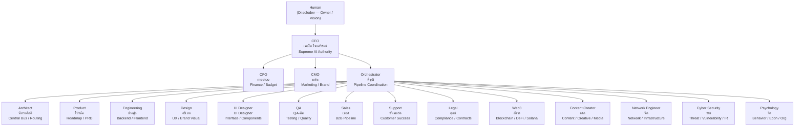

<!--
  SoloCorp OS — README
  Funnel: Hook → Prerequisite → Try → Evidence
  Counts below are from the git tree. Do not put a number here that is not in the tree.
  v2.4.0 is the product-pack line, not "the OS is finished".
-->

<details>
<summary><strong>SoloCorp OS</strong> — ASCII banner (click to expand)</summary>

```text
================================================================================
  ███████  ██████  ██       ██████   ██████  ██████  ██████  ██████  
  ██      ██    ██ ██      ██    ██ ██      ██    ██ ██   ██ ██   ██ 
  ███████ ██    ██ ██      ██    ██ ██      ██    ██ ██████  ██████  
       ██ ██    ██ ██      ██    ██ ██      ██    ██ ██   ██ ██      
  ███████  ██████  ███████  ██████   ██████  ██████  ██   ██ ██      


   ██████  ███████  ███████   ██   ██
  ██    ██ ██            ██   ██   ██
  ██    ██ ███████  ███████ █ ███████
  ██    ██      ██  ██      █      ██
   ██████  ███████  ███████        ██
================================================================================
              PACK LINE v2.4  ·  SYSTEM STILL PRE-RELEASE
================================================================================
```

</details>

# SoloCorp OS

**Department Architecture for AI Agents** — turn a single AI into a workforce where every unit of work has a named owner, a specialist executor, and an explicit handoff.

This repository is a **pre-release**. **v2.4.0 is the product-pack line** (CFO, Legal, Content Creator). It is not a claim that the operating system is finished.

**Status:**
[](https://github.com/Dr-SoloDev/Lab-solocorp-os2.4/releases/tag/v2.4.0-pre)
[](https://github.com/Dr-SoloDev/Lab-solocorp-os2.4/releases)
[](https://github.com/Dr-SoloDev/Lab-solocorp-os2.4/actions/workflows/copilot-setup-steps.yml)
[](LICENSE)

**In this tree, today:**
[](profiles/INDEX.md)
[](skills)
[](.opencode/agents)

**Platform:**
[](#product-packs--v240-pre-release)
[](https://github.com/Dr-SoloDev/Lab-solocorp-os2.4)
[](docs/GROK-SUPPORT.md)

> **License:** [MIT](LICENSE) — เอาไปใช้ ปรับ แจก ขายต่อได้อิสระ ขอแค่เก็บ copyright ไว้
> ⭐ ถ้าชอบ ฝากกด **Star** เป็นกำลังใจ — แล้วเอาทีมของคุณมาอวดใน [Discussions](https://github.com/Dr-SoloDev/Lab-solocorp-os2.4/discussions)!

## 🌱 หนึ่งแกน หลายตัวตน

SoloCorp OS เกิดจากแกนเดียวกัน แต่**ไม่จำเป็นต้องเหมือนกัน** — fork ไป เปลี่ยนชื่อ
ปรับแผนก เพิ่มลดได้ตามใจ ขอแค่ให้มัน*เข้ากับตัวคุณ* ระบบที่ดีคือระบบที่เจ้าของใช้แล้ว
มีความสุข ไม่ใช่ระบบที่เหมือนต้นฉบับที่สุด — *แตกต่างไม่แตกแยก เป็นตัวของตัวเอง*

ดูวัฒนธรรมการแบ่งปันที่ [`COMMUNITY.md`](./COMMUNITY.md) 💬

---

## Prerequisite

The 30-second try assumes one tool is already installed.

| You want | You need first |
|:---------|:---------------|
| Talk to the CEO | OpenCode CLI, so `opencode` is on your `PATH` |
| Codex sub-agents | Python 3.10+ |
| Grok project pack | Read [`docs/GROK-SUPPORT.md`](./docs/GROK-SUPPORT.md) first. This is not the 30-second path. |
| Copilot Cloud Agent | [`COPILOT-SETUP.md`](./COPILOT-SETUP.md) |

---

## Try it

```bash
git clone https://github.com/Dr-SoloDev/Lab-solocorp-os2.4.git
cd Lab-solocorp-os2.4
opencode "@ceo-turbo เริ่มกันเลย"
```

The CEO routes from there. `@mention` a Head when you already know the department.

**Codex CLI (optional):**

```bash
python3 scripts/export-codex-agents.py
codex
```

**Grok (optional, after the support doc):** skills for `/status`, `/route`, `/pipeline`, `/handoff`, `/audit`, `/deploy`, and `/brain` live in [`.grok/skills`](./.grok/skills).

### Pipeline commands

These names exist as commands in `opencode.json`.

| Command | Action |
|:--------|:-------|
| `/pipeline <feature>` | Run SoloCorp full cycle |
| `/handoff <from> <to> <task>` | Structured department handoff |
| `/status` | View pipeline health |
| `/audit [scope]` | Inspect audit trail |
| `/deploy` | Deploy profiles and config |
| `/brain <context>` | Save session to brain memory |
| `/workspace [dept] [task]` | Open department workspace (แยกแชทพร้อมตัวตน+บริบท) |

🏢 **Multi-chat workspaces:** 1 แผนก = 1 แชท — ดู [`docs/OPENCODE-GUIDE.md`](./docs/OPENCODE-GUIDE.md) (คน+agent อ่านได้ในไฟล์เดียว)

---

## What is SoloCorp OS?

SoloCorp OS is an **organizational operating system for AI agents** — a Department Architecture that gives every unit of work an owner, a specialist executor, and a defined handoff path.

Instead of a monolithic AI trying to do everything, SoloCorp OS gives you:

- **A public chart of 18 named Heads** — listed below. The tree also has `profiles/02-coo` and `profiles/19-rd-lab`, which are not on that chart yet.
- **Specialists per profile** — each `team/*.SOUL.md` is one specialist. There is no single counted roster in this repo, so this page does not print one.
- **Two-Tier Architecture** — control flows Head-to-Head; data flows through a Central Bus.
- **Clear Chain of Command** — Human → CEO → C-Level → Department Heads → Specialist Teams.

The design is inspired by how real companies scale: clear hierarchy, delegated authority, and autonomous execution at every level. No orphan work. No ambiguous ownership.

---

## The Problem We Solve

Monolithic AI agents break down as complexity grows:

- **Context collapse** — a single AI juggling 15+ concerns loses depth; no specialist ownership
- **No accountability chain** — when one prompt does everything, there is no clear owner
- **Throughput ceiling** — every request bottlenecks through one context window
- **Implicit handoffs** — coordination is unstructured; work gets lost or silently dropped

SoloCorp OS replaces that single point of failure with a structured department hierarchy — each unit of work has a named owner, a specialist executor, and an explicit handoff path through the Central Bus.

---

## What is actually in the tree

Counted on the `main` tree. If a future commit changes a count, change this table in the same commit.

| Claim | Count | Where |
|:------|------:|:------|
| Profile directories | 20 | `profiles/01-ceo` … `profiles/19-rd-lab`, including both `02-cfo` and `02-coo` |
| Named Heads on the chart below | 18 | This page. COO and R&D Lab are in the tree only. |
| Canonical skills | 9 | `skills/@solocorp/**/SKILL.md` |
| OpenCode agent files | 21 | `.opencode/agents/*.md` |
| Primary agents registered in `opencode.json` | 4 | `ceo-turbo`, `build`, `plan`, `explore` |

Copies under `.claude/skills` and `.grok/skills` are platform packs, not a second copy of the canonical catalog: `.grok/skills/` holds 7 command skills (`audit`, `brain`, `deploy`, `handoff`, `pipeline`, `route`, `status`), and `.claude/skills/solocorp/` carries its own set (with extras like `agent-toolkit` and `ui-animation-review`, without `cross-dept/dept-workspace`). COO, R&D Lab, Network (นีต), Cyber Security (ซาย), and Psychology (จิต) do not yet have a file in `.opencode/agents/`.

---

## Key Features

| Feature | What you can verify |
|:--------|:--------------------|
| **Ownership Model** | Every charted department has a Head |
| **Delegation by Design** | Heads direct, escalate, and hand off — they do not implement |
| **Two-Tier Architecture** | Control layer separated from data layer |
| **Central Bus** | `central_bus/` — FastAPI daemon in the tree. Pre-release, not a finished control plane. |
| **Head-to-Head Handoff** | Work moves between departments without a single bottleneck |
| **9 canonical skills** | `skills/@solocorp/` |
| **21 OpenCode agent files** | `.opencode/agents/` — not all 20 profiles have one |
| **Codex CLI Export** | `scripts/export-codex-agents.py` |
| **xGov Governance** | RFC → ADR → Guard Gates, under `decisions/` and `gov/` |
| **Loop Runner** | `loop_runner/` — cron auto-pilot intended every 30 min |

---

## Architecture


```mermaid
graph TD
    Human["Human<br/>(Dr.solodev — Owner / Vision)"]
    CEO["CEO<br/>เทอโบ ไชยศรีรัมย์<br/>Supreme AI Authority"]
    CFO["CFO<br/>meetoo<br/>Finance / Budget"]
    CMO["CMO<br/>มาร์ค<br/>Marketing / Brand"]
    Orch["Orchestrator<br/>พี่วุฒิ<br/>Pipeline Coordination"]
    Arch["Architect<br/>พี่ทรงศักดิ์<br/>Central Bus / Routing"]
    Prod["Product<br/>โปรดัค<br/>Roadmap / PRD"]
    Eng["Engineering<br/>ช่างฟูล<br/>Backend / Frontend"]
    Des["Design<br/>ครีเอท<br/>UX / Brand Visual"]
    UI["UI Designer<br/>UI Designer<br/>Interface / Components"]
    QA["QA<br/>QA-ทีม<br/>Testing / Quality"]
    Sales["Sales<br/>เซลส์<br/>B2B Pipeline"]
    Sup["Support<br/>ซัพพอร์ต<br/>Customer Success"]
    Legal["Legal<br/>ตุลย์<br/>Compliance / Contracts"]
    Web3["Web3<br/>อัยวา<br/>Blockchain / DeFi / Solana"]
    Content["Content Creator<br/>เสก<br/>Content / Creative / Media"]
    NetEng["Network Engineer<br/>นีต<br/>Network / Infrastructure"]
    CyberSec["Cyber Security<br/>ซาย<br/>Threat / Vulnerability / IR"]
    Psych["Psychology<br/>จิต<br/>Behavior / Econ / Org"]


    Human --> CEO
    CEO --> CFO
    CEO --> CMO
    CEO --> Orch
    Orch --> Arch
    Orch --> Prod
    Orch --> Eng
    Orch --> Des
    Orch --> UI
    Orch --> QA
    Orch --> Sales
    Orch --> Sup
    Orch --> Legal
    Orch --> Web3
    Orch --> Content
    Orch --> NetEng
    Orch --> CyberSec
    Orch --> Psych
```

The chart is the 18 named Heads. Not drawn, but present in the tree: COO (`profiles/02-coo`) and R&D Lab (`profiles/19-rd-lab`).

> **Why the Orchestrator is not the bottleneck it looks like:** the arrows above are the *command* hierarchy (who reports to whom), not the data path. Work coordination between departments is Head-to-Head; the Orchestrator only sees status, goals, exceptions, and approvals. Actual payloads (code, designs, reports) never pass through it — they flow Specialist → Central Bus → Specialist, so there is no single context window to clog.

**Two-Tier Architecture**

```
CONTROL LAYER (Head-to-Head)
  Status · Goals · Exceptions · Approvals · Handoffs
  Head A ──(status/report)──→ Head B


DATA LAYER (Autonomous)
  Code · Designs · Reports · Raw Outputs
  Specialist A ──(write)──→ CENTRAL BUS ──(notify)──→ Specialist B
                                 └── Queue
```

---

## Product Packs — v2.4.0 Pre-release

v2.4.0 means these three profiles are being cut as packs. They are still directories inside this repository. Cloning the repo is the install. There is no separate package and no "no setup" path.

Specialist counts are `team/*.SOUL.md` files, not including the Head.

| Pack | Head | What it does | Team SOUL files |
|:-----|:-----|:-------------|:---------------:|
| **CFO Pack** `@cfo-meetoo` | meetoo | Budget control · Financial analysis · Audit trail · Tax strategy · FP&A | 3 |
| **Legal Pack** `@legal-tulya` | ตุลย์ (Tul) | Contract review · License compliance · Risk assessment · Data governance | 3 |
| **Content Creator Pack** `@content-creator-sek` | เสก (Sek) | Multi-platform content · Video production · Copywriting · Visual creation | 0 |

CFO's three files are `meetoo/team/01-dana`, `02-riley`, `03-morgan`. Legal's three are under `tulya/team/`. Content Creator's directory currently has the Head only.

Each listed pack has a **SOUL.md** and routing rules. A skill library ships with the repo (`skills/@solocorp/`), not as a per-pack download.

All three packs are open: fork it, clone it, `@mention` the Head. There is no qualification gate in the tree (no such flow in `profiles/02-cfo` or the CFO agent file):

```bash
opencode "@cfo-meetoo ช่วยดูงบให้หน่อย"
```

---

## The Team

### C-Level Executives

| # | Role | Name | Responsibility |
|:-:|:-----|:-----|:--------------|
| 01 | CEO | เทอโบ (Turbo Chaisriram) | Vision, Strategy, Final Decision |
| 02 | CFO | meetoo | Finance, Budget, Investment |
| 03 | CMO | มาร์ค (Mark) | Marketing, Content, Brand |

### System Pipeline

| # | Role | Name | Responsibility |
|:-:|:-----|:-----|:--------------|
| 04 | Orchestrator | พี่วุฒิ (Wut) | Cross-Department Pipeline Coordination |
| 05 | Architect | พี่ทรงศักดิ์ (Songsak) | Central Bus, Routing, Monitoring |

### Product & Engineering

| # | Role | Name | Responsibility |
|:-:|:-----|:-----|:--------------|
| 06 | Product | โปรดัค (Produck) | Feature Roadmap, PRD, Delivery |
| 07 | Engineering | ช่างฟูล (Changful) | Backend, Frontend, Architecture |
| 08 | Design | ครีเอท (Kreet) | UX Research, Brand Visual |
| 09 | UI Designer | UI Designer | Interface, Component Library |

### Quality, Revenue & Customer

| # | Role | Name | Responsibility |
|:-:|:-----|:-----|:--------------|
| 10 | QA | QA-ทีม (QA Team) | Testing, Quality, Evidence |
| 11 | Sales | เซลส์ (Sales) | B2B Deal Strategy, Pipeline |
| 12 | Support | ซัพพอร์ต (Support) | Customer Success, Analytics |

### Legal, Blockchain & Content

| # | Role | Name | Responsibility |
|:-:|:-----|:-----|:--------------|
| 13 | Legal | ตุลย์ (Tul) | Compliance, Contracts, Law |
| 14 | Web3 | อัยวา (Aywa) | Blockchain, DeFi, Solana |
| 15 | Content Creator | เสก (Sek) | Content, Creative, Media |
| 16 | Network Engineer | นีต (Neet) | Network Design, Infrastructure, CDN, VPN |
| 17 | Cyber Security | ซาย (Sai) | Threat Detection, Vulnerability, Incident Response |
| 18 | Psychology | จิต (Jit) | User Behavior, Behavioral Economics, Org Psychology |

**On this chart: 18 named Heads.** Profile directories in the tree: 20. Specialist headcount is not printed here until a manifest exists.

---

## Development Status

No percent bars. A row marked **In tree** means the files exist. It does not mean done. The system line is still **pre-release**. v0.x is that system line. **v2.4.0 is only the pack line.**

| Phase | Content | Version | Status |
|:------|:--------|:-------:|:------:|
| Foundation | ADRs + CEO profile + architecture docs | v0.1–v0.2 | In tree |
| Pipeline agents | Architect-side pipeline agent files | v0.3 | In tree |
| Department profiles | 20 directories, 18 of them charted above | v0.5 | In tree |
| Hermes shape | Profile files under `profiles/` | v0.5.1 | In tree — a live Hermes deploy is not proven by this repo |
| Sub-agent teams | `team/*.SOUL.md` under most profiles | v0.6.1 | Partial — Content Creator has none |
| Central Bus | `central_bus/` FastAPI daemon, SQLite + JSONL compat (`use_sqlite` switch) | v0.6 | In tree, pre-release |
| Multi-platform | Hermes · OpenCode · Claude Code · Codex · Grok docs | v0.7 | Partial |
| Dashboard + compliance | Pipeline dashboard + audit UI | v0.7 | Planned |
| Product packs | CFO · Legal · Content Creator profiles | v2.4.0 | Pre-release |
| Public launch | GTM · content · skill docs | v0.7 | Partial — this README is part of that work |
| Loop runner | `loop_runner/` cron auto-pilot | v0.5+ | In tree |

`PROJECT.md` still says in one FAQ answer that the Central Bus is "in design" and that the system is production-ready (its own status table also marks the bus "Production Ready" in places). Those answers are stale. Believe this table, then the code.

---

## Get Started

1. Install OpenCode.
2. Clone this repo and run `opencode "@ceo-turbo เริ่มกันเลย"`.
3. Use `@mention` to reach a Head directly.
4. Run `/pipeline <feature>` for a cross-department cycle.

**Reference docs:**

- `profiles/INDEX.md` — profile index (reconcile it with the count table above before quoting it)
- `docs/ARCHITECTURE.md` — system design, principles, and flow
- `PROJECT.md` — longer tour; its status FAQ is stale where it disagrees with this page
- `CHANGELOG.md` — version history and release notes
- `COPILOT-SETUP.md` — GitHub Copilot Cloud Agent
- `decisions/` — Architecture Decision Records (ADRs)
- `dist/codex/README-CODEX-CLI.md` — Codex CLI export
- `docs/GROK-SUPPORT.md` — Grok pack

---

<div align="center">

**SoloCorp OS — System First, Everything Follows**  
[MIT License](LICENSE) · Copyright (c) 2026 SoloCorp Organization (Dr-SoloDev)  
Use, modify, and sell copies. Keep this copyright notice.  
Built by Dr.SoloDev & เทอโบ ไชยศรีรัมย์

</div>
