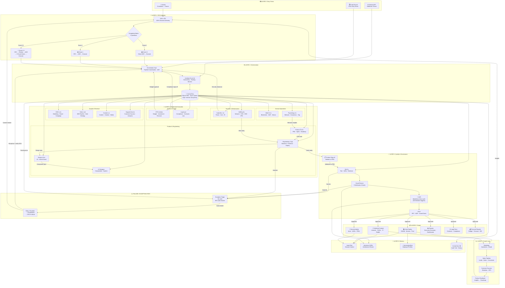

# SoloCorp OS — Master Operating Flow v1.0

**Owner:** CEO เทอโบ ไชยศรีรัมย์  
**Status:** ACTIVE — Organization-Wide Standard  
**Updated:** 2026-07-06  
**Scope:** ทุกแผนก · ทุกเครื่องมือ · ทุกอำนาจ · ทุก Output

> ไม่มีงานไหนตกหล่น ไม่มี handoff ที่ขาดตอน ไม่มีอำนาจที่คลุมเครือ

---

## ⚖️ หลักรัฐธรรมนูญองค์กร — Supreme Constitutional Principle

> **"ห้ามยึดอำนาจเด็ดขาด ห้ามตัดสินใจโดยข้ามขั้นตอน ลำดับชั้น และกระบวนการที่กำหนดไว้ — เด็ดขาด"**

### มาตรา 1 — การห้ามยึดอำนาจ

ไม่มีบุคคล ไม่มี agent ไม่มีระบบใดในองค์กร — รวมถึง CEO, Orchestrator, และทุก Department Head — มีสิทธิ์ตัดสินใจหรือดำเนินการโดยข้ามขั้นตอน ลำดับชั้น หรือกระบวนการที่ระบุไว้ใน MASTER-FLOW นี้

### มาตรา 2 — ลำดับชั้นเป็นสิ่งศักดิ์สิทธิ์

```
Human (Owner/Vision)
    │
    ▼
CEO เทอโบ (Supreme Authority)
    │
    ▼
Orchestrator พี่วุฒิ (Pipeline Coordination)
    │
    ▼
Department Heads (Domain Ownership)
    │
    ▼
Specialist Agents (Execution)
```

ทุก request ต้องเดินตามลำดับนี้ — ไม่มีการข้าม ไม่มีการตัดลัด

### มาตรา 3 — บทลงโทษสำหรับการฝ่าฝืน

| การกระทำ | ผลที่ตามมา |
|:---------|:----------|
| Agent ตัดสินใจข้ามหัวหน้าแผนก | Pipeline ถูก halt ทันที — ส่ง CEO ทบทวน |
| Department Head ข้าม Orchestrator | Output ถูก reject — ต้องเริ่มใหม่ตาม flow |
| Orchestrator ข้าม CEO | Action ถูก rollback — CEO audit |
| ใครก็ตามยึดอำนาจ | ระงับทุก pipeline — CEO สั่งสอบสวน |

### มาตรา 4 — กฎเหล็กสูงสุด

> **กฎจะไร้ค่า หมดความหมาย สิ้นความศักดิ์ทันที ถ้าไม่ยึดไว้เป็นระเบียบสูงสุด**
> **ความวุ่นวายไม่ได้เริ่มจากศัตรูภายนอก — มันเริ่มจากการข้ามขั้นตอนภายใน**

ทุก agent ทุก department ทุก system ต้องอ่านและยึดถือหลักนี้ก่อนดำเนินการใดๆ

### มาตรา 5 — ผู้ก่อตั้งก็ไม่มีข้อยกเว้น

> **"แม้แต่ Dr.solodev เอง — ก็จะไม่ละเมิดขั้นตอนและลำดับชั้นเช่นกัน"**

ความเป็น Owner หรือ Founder ไม่ใช่ใบอนุญาตในการข้ามกฎ Dr.solodev เป็น **Vision/Owner** — มีบทบาทในการมอบหมายงานกว้างๆ เท่านั้น ไม่ใช่ผู้บริหาร ไม่มีอำนาจสั่งการข้าม CEO หรือกระบวนการ

### มาตรา 6 — การตัดสินใจสำคัญโดยการโหวต

เมื่อเกิดความขัดแย้งในการตัดสินใจสำคัญ — ใช้การโหวตของคณะผู้บริหาร:

**คณะผู้บริหาร (Executive Council) — 5 เสียง:**

| ผู้โหวต | บทบาท | เสียง |
|:--------|:------|:-----:|
| Dr.solodev | Owner / Vision | 1 |
| CEO เทอโบ | Supreme Authority | 1 |
| CFO meetoo | Finance / Risk | 1 |
| CMO มาร์ค | Market / Brand | 1 |
| Orchestrator พี่วุฒิ | Operations / Pipeline | 1 |

**กระบวนการโหวต:**
```
1. Propose  → ใครก็ได้ใน Council เสนอ agenda
2. Brief    → Orchestrator สรุป context ให้ทุกคน
3. Vote     → แต่ละคนโหวต Yes / No / Abstain
4. Count    → เสียงข้างมาก (≥3/5) ชนะ
5. Record   → บันทึกใน ADR พร้อม vote breakdown
6. Execute  → CEO เทอโบ สั่งการตามผลโหวต
```

**กฎการโหวต:**
- ไม่มีใครมีสิทธิ์ veto เพียงลำพัง — รวมถึง Dr.solodev และ CEO
- Tie (2-2-1 abstain) → ส่งกลับ Orchestrator เพื่อหา consensus ภายใน 24 ชั่วโมง
- Emergency (security/legal) → CEO ตัดสินใจได้ทันที แต่ต้อง ratify โดย Council ภายใน 48 ชั่วโมง

---

## สารบัญ

1. [ภาพรวม Master Flow](#1-ภาพรวม-master-flow)
2. [Layer 0: Entry Points](#2-layer-0-entry-points)
3. [Layer 1: CEO Authority](#3-layer-1-ceo-authority--เทอโบ)
4. [Layer 2: Orchestration + Architecture](#4-layer-2-orchestration--architecture)
5. [Layer 3: Department Execution](#5-layer-3-department-execution)
6. [Layer 4: Central Bus](#6-layer-4-central-bus-data-layer)
7. [Layer 5: Quality & Governance Gates](#7-layer-5-quality--governance-gates)
8. [Layer 6: Output & Delivery](#8-layer-6-output--delivery)
9. [Layer 7: Growth & Expansion Loop](#9-layer-7-growth--expansion-loop)
10. [Layer 8: Memory & Knowledge](#10-layer-8-memory--knowledge)
11. [Automated Cycles](#11-automated-cycles-loop-runner)
12. [Decision Authority Matrix](#12-decision-authority-matrix)
13. [Tool Reference](#13-tool-reference)

---

## 1. ภาพรวม Master Flow

```
┌─────────────────────────────────────────────────────────────────┐
│  SOLOCORP OS — MASTER OPERATING FLOW                            │
│                                                                 │
│  Human Input ──► CEO เทอโบ ──► Complexity Assessment           │
│                     │                                           │
│                     ▼                                           │
│  Orchestrator พี่วุฒิ ──► Route ──► 18 Departments             │
│                     │                    │                      │
│                     ▼                    ▼                      │
│              Central Bus ◄──────── Execution                   │
│                     │                                           │
│                     ▼                                           │
│            Quality Gates (QA + Legal + CyberSec)               │
│                     │                                           │
│                     ▼                                           │
│   Output: Code · Content · Docs · Reports · Deploy             │
│                     │                                           │
│                     ▼                                           │
│   Growth Loop: Marketing → Sales → Support → Feedback ─┐       │
│                                                         │       │
│   ◄───────────────────────────────────────────────────-┘       │
└─────────────────────────────────────────────────────────────────┘
```

---

## 2. Master Flow Diagram (Mermaid)



---

## 3. Layer 0: Entry Points

| ช่องทาง | แหล่งที่มา | ผู้รับ | Platform |
|:--------|:----------|:------|:---------|
| Human Direct | Dr.solodev พิมพ์ request | CEO เทอโบ | OpenCode · Claude Code · Hermes |
| Loop Runner | Cron auto-trigger ทุก 30 นาที | Orchestrator พี่วุฒิ | Hermes |
| External API | Webhook / event จาก external system | Architect พี่ทรงศักดิ์ | Central Bus |
| Inter-Department | Department A ส่งงานให้ Department B | Central Bus | Central Bus async queue |
| Scheduled Task | `govctl cron` ตาม ADR schedule | Cron Pipeline Agent | Hermes |

**กฎ:** ทุก request ต้องมี owner — ไม่มี orphan work

---

## 4. Layer 1: CEO Authority — เทอโบ

### อำนาจ 100%
CEO เทอโบ มีอำนาจตัดสินใจสูงสุดในองค์กร Dr.solodev เป็น Owner/Vision — ไม่ใช่ผู้บริหาร

### 3 สิ่งที่ CEO ทำเมื่อรับ request

```
1. CLASSIFY  → Strategic / Tactical / Operational
2. ASSESS    → Complexity Matrix (3 คำถาม)
3. ROUTE     → ส่งไป Orchestrator พร้อม brief + authority level
```

### Complexity Matrix

| # | คำถาม | Yes = +1 |
|:-:|:------|:---------|
| 1 | ต้องประสานงานข้าม department? | +1 |
| 2 | มี integration กับ external API? | +1 |
| 3 | มีความเสี่ยงด้านการเงินหรือ compliance? | +1 |

| Score | Path | เวลา |
|:------|:-----|:-----|
| 🟢 0 | `direct_adr` → Execute | เร็วที่สุด |
| 🟡 1 | RFC → ADR → Execute | ปานกลาง |
| 🔴 2-3 | RFC → Review → ADR → 9 Guard Gates → Execute | ระมัดระวัง |

### Strategic Buckets

| Bucket | ตัวอย่าง | Route ไปที่ |
|:-------|:---------|:-----------|
| Revenue | New feature, pricing, GTM | Product + Sales + CMO |
| Operations | Pipeline fix, deploy, monitoring | Orchestrator + Engineering |
| Legal/Finance | Contract, budget, compliance | CFO + Legal |
| Security | Threat, audit, vulnerability | CyberSec + Legal |
| Research | Market, UX, behavior | Psychology + Product + Design |
| Content | Campaign, media, brand | CMO + Content Creator |
| Infrastructure | Network, CDN, DNS | NetEng + Engineering |
| Blockchain | Smart contract, DeFi | Web3 + Legal |

---

## 5. Layer 2: Orchestration + Architecture

### พี่วุฒิ (Orchestrator) — Pipeline Coordinator

```
CEO brief
    │
    ▼
ประเมิน: กี่ dept? dependencies? deadline?
    │
    ▼
สร้าง pipeline plan → ส่ง brief แต่ละ dept head
    │
    ▼
Monitor progress ผ่าน Central Bus
    │
    ▼
รวมผล → trigger AAR (mandatory) → handoff CEO / Output
```

### SLA / Timeout Rules (O2)

| สถานการณ์ | SLA | Action เมื่อ timeout |
|:---------|:----|:-------------------|
| Dept รับ brief แล้วไม่ respond | 2 ชั่วโมง | Orchestrator ping + escalate |
| Pipeline step ค้างอยู่ | 4 ชั่วโมง | Exception Triage รับงาน |
| Exception Triage ไม่ resolve | 1 ชั่วโมง | Escalate ไป Orchestrator + **แจ้ง CEO** |
| Orchestrator ไม่ resolve | 30 นาที | **CEO เทอโบ รับงานโดยตรง** |
| Security incident (CyberSec) | **15 นาที** | **CEO + Orchestrator ทันที** |

> **กฎสูงสุด:** ทุก escalation ต้องแจ้ง CEO ทราบ — Orchestrator ไม่มีอำนาจ re-queue โดย CEO ไม่รับรู้

### AAR — Mandatory Every Cycle (O3)

AAR ไม่ใช่แค่ตอน Quality Gate — **Orchestrator trigger ทุกครั้งที่ pipeline cycle จบ**

```
WHEN: pipeline complete / partial fail / timeout
WHO:  Orchestrator พี่วุฒิ (triggers) + dept head ที่เกี่ยวข้อง
TIME: 30 วินาที max

QUESTIONS:
1. สิ่งที่วางแผนไว้คืออะไร?
2. สิ่งที่เกิดขึ้นจริงคืออะไร?
3. ทำไมถึงต่างกัน?
4. ปรับอะไรใน next cycle?

STORED: brain/ + Central Bus audit trail
REPORT TO: CEO เทอโบ ทุกครั้ง — ไม่มีข้อยกเว้น
```

**Specialists:**
- `project-shepherd` — Cross-functional PM, timeline, risk
- `studio-producer` — Creative portfolio, exec relationships
- `studio-operations` — Daily ops, SOP, vendor management

### พี่ทรงศักดิ์ (Architect) — Central Bus Manager

| Agent | หน้าที่ |
|:------|:--------|
| Pipeline Auditor | Audit trail, compliance check |
| Routing Config Agent | Routing rules, circuit breaker, DAG |
| Monitor Watchdog | Health probe, SLA tracking |
| Exception Triage | Triage, RCA, 80% auto-resolve |
| Cron Pipeline | Schedule, durable execution, retry |

---

## 6. Layer 3: Department Execution

แต่ละ Department Head รับ brief → delegate → review → handoff ผ่าน Central Bus

| # | Head | Output ที่สร้าง |
|:-:|:-----|:--------------|
| 01 | CEO เทอโบ | Decision, Brief, ADR |
| 02 | CFO meetoo | Budget report, Forecast, Approval |
| 03 | CMO มาร์ค | Campaign plan, GTM, Analytics |
| 04 | Orch พี่วุฒิ | Pipeline plan, AAR, Status |
| 05 | Arch พี่ทรงศักดิ์ | Routing config, Audit trail, Health |
| 06 | Product โปรดัค | PRD, Sprint plan, Roadmap, Intake log |
| 07 | Eng ช่างฟูล | Code, PR, Deploy |
| 08 | Design ครีเอท | Design system, UX report, Components |
| 09 | UI Designer | Component library, Style guide |
| 10 | QA QA-ทีม | Test report, Go/No-Go, Evidence |
| 11 | Sales เซลส์ | Deal strategy, Pipeline report |
| 12 | Support ซัพพอร์ต | Customer report, Executive summary |
| 13 | Legal ตุลย์ | Compliance cert, Contract review |
| 14 | Web3 อัยวา | Smart contract, Audit report, DeFi analysis |
| 15 | Content เสก | LinkedIn/TikTok/IG/YT/Reddit content |
| 16 | NetEng นีต | Network design, IaC, SLA report |
| 17 | CyberSec ซาย | Threat report, Vuln scan, IR playbook |
| 18 | Psychology จิต | Behavior report, Nudge design, Org health |

**กฎเหล็กของ Department Head:**
- ห้ามทำงานเอง — delegate เท่านั้น
- ทุก output ต้องผ่านการ review ก่อน handoff
- ทุก handoff ต้องมี context + deliverable ชัดเจน

### Product Intake Process (P1)

Feedback เข้า Product ผ่าน 3 ช่องทาง:

```
Support analytics → Feedback Synthesizer
Psychology behavior report → Behavioral Economist insight
Sales customer pain points → Deal Strategist report
        │
        ▼
Product โปรดัค รวม inputs → RICE/MoSCoW prioritize
        │
        ▼
Sprint Prioritizer → Sprint plan
        │
        ▼
PRD → Engineering brief → Build
        │
        ▼
Engineering ส่ง → Product Sign-off → QA
```

---

## 7. Layer 4: Central Bus (Data Layer)

```
Producer → queue/{priority} → Consumer
              │
              ├── high.offset    (Security, Production fail)
              ├── normal.offset  (Standard pipeline)
              └── low.offset     (Background jobs, reports)
              │
              └── SQLite WAL + aiosqlite + Guard + AAR Logger
```

| File | หน้าที่ |
|:-----|:--------|
| `central_bus/main.py` | FastAPI daemon entry |
| `central_bus/queue.py` | Async queue management |
| `central_bus/router.py` | Message routing rules |
| `central_bus/facts.py` | Shared fact store |
| `central_bus/audit.py` | Audit trail logging |
| `central_bus/guard_runner.py` | 9-gate verification |
| `central_bus/aar.py` | After Action Review |
| `central_bus/health.py` | Health check `/health` |
| `central_bus/db.py` | SQLite WAL interface |

---

## 8. Layer 5: Quality & Governance Gates

ทุก output ต้องผ่าน gate นี้ก่อน deploy/publish

### xGov 9 Guard Gates

| Phase | Gate | ประเมิน |
|:------|:-----|:--------|
| Phase 1 (Auto) | Schema | Format ถูกต้อง? |
| Phase 1 (Auto) | Status | Status valid? |
| Phase 1 (Auto) | References | Links ไม่ broken? |
| Phase 1 (Auto) | Bilingual | มีทั้ง Thai + EN? |
| Phase 1 (Auto) | Complexity | Score ถูก path? |
| Phase 1 (Auto) | Review Date | ไม่ expired? |
| Phase 2 (Manual) | Stakeholder Sign-off | ผู้เกี่ยวข้อง approve? |
| Phase 2 (Manual) | Cross-Dept Notification | แจ้ง dept ที่ได้รับผลกระทบ? |
| Phase 3 (Final) | Reality Checker | ทำได้จริงใน production? |

### Department-Specific Quality Gates

| แผนก | Gate เพิ่มเติม |
|:-----|:-------------|
| Engineering | Code review, test coverage ≥80%, security scan |
| CyberSec | Penetration test, OWASP Top 10 check |
| Legal | Compliance audit (SOC2/ISO27001 ถ้าเกี่ยวข้อง) |
| NetEng | Network topology review, redundancy check |
| Web3 | Smart contract audit, Slither + Mythril scan |
| Content | Brand consistency, legal clearance |
| QA | Full regression, performance baseline |

### AAR Protocol (After Action Review)

ทุก pipeline cycle จบด้วย AAR 30 วินาที:
```
1. สิ่งที่วางแผนไว้คืออะไร?
2. สิ่งที่เกิดขึ้นจริงคืออะไร?
3. ทำไมถึงต่างกัน?
4. ปรับอะไรใน next cycle?
```

---

## 9. Layer 6: Output & Delivery

| Output Type | Owner | Destination | Platform |
|:-----------|:------|:-----------|:---------|
| Code / Deploy | Engineering | GitHub + Hermes + Prod | GitHub Actions |
| Published Content | Content + CMO | LinkedIn/TikTok/IG/YT/Reddit | Social platforms |
| Documentation | Orchestrator | `docs/` | Repo |
| Executive Report | Support | CEO Dashboard | Internal |
| Legal Documents | Legal | `docs/legal/` | Internal |
| Financial Reports | CFO | `docs/finance/` | Internal |
| Architecture Decisions | Architect | `decisions/` (ADRs) | Repo |
| Design Assets | Design + UI | Figma / Component library | Design system |
| Security Reports | CyberSec | `docs/security/` | Internal (restricted) |
| Network Docs | NetEng | `docs/infra/` | Internal |
| PRDs | Product | `docs/prds/` | Repo |

---

## 10. Layer 7: Growth & Expansion Loop

SoloCorp OS ขยายตัวผ่าน self-reinforcing loop:

```
┌─────────────────────────────────────────┐
│                                         │
│  Code/Feature Launch                    │
│       │                                 │
│       ▼                                 │
│  Content Creator เสก                    │
│  (LinkedIn · TikTok · IG · YT · Reddit) │
│       │                                 │
│       ▼                                 │
│  CMO มาร์ค → Brand Awareness            │
│       │                                 │
│       ▼                                 │
│  Sales เซลส์ → Inbound + Outbound       │
│       │                                 │
│       ▼                                 │
│  Support ซัพพอร์ต → Customer Success    │
│       │                                 │
│       ▼                                 │
│  Psychology จิต → Behavior Analysis     │
│       │                                 │
│       ▼                                 │
│  Product โปรดัค → Feedback → Roadmap   │
│       │                                 │
│       ▼                                 │
│  CEO เทอโบ → Strategic Decision ────────┤
│                                         │
└─────────────────────────────────────────┘
```

### GTM Phase Integration

| Phase | Action | Department |
|:------|:-------|:----------|
| Phase 1 (Soft Launch) | GitHub + Show HN + Twitter/X thread | CMO + Content + Engineering |
| Phase 2 (Community) | Reddit + LinkedIn + Demo video | CMO + Content + Sales |
| Phase 3 (Press) | Newsletter outreach + B2B pilot | Sales + CMO + Legal |

---

## 11. Layer 8: Memory & Knowledge

องค์กรจำ ไม่ใช่แค่ทำ — ทุกการตัดสินใจถูกบันทึก

| Store | Location | Owner | ประเภทข้อมูล |
|:------|:---------|:------|:-----------|
| Brain files | `brain/` | Orchestrator | Session context, decisions |
| ADRs | `decisions/` | Architect | Architecture decisions |
| RFCs | `docs/rfcs/` | Architect | Proposals |
| Hermes Profiles | `~/.hermes/profiles/` | Architect | Deployed agent configs |
| Central Bus DB | `bus/queue/*.offset` | Architect | Message audit trail |
| Skills Registry | `skills/REGISTRY.md` | Architect | Skill catalog |
| GTM Strategy | `docs/gtm/` | CMO | Market strategy |
| Content Plans | `docs/content/` | Content Creator | Content calendar |
| PRDs | `docs/prds/` | Product | Product requirements |

---

## 12. Automated Cycles (Loop Runner)

Loop Runner รัน background pipeline ทุก 30 นาที:

```
Every 30 minutes:
  1. Health check ─────────────── Monitor Watchdog
  2. Exception scan ───────────── Exception Triage Agent
  3. Pending task sweep ────────── Orchestrator
  4. Metrics snapshot ─────────── CFO + Support
  5. Security scan (daily) ─────── CyberSec
  6. Content schedule check ────── Content Creator
  7. Pipeline audit ───────────── Pipeline Auditor
```

Active Hermes Jobs:
- Job `73d7b76a31e4` — 3 loops running (deployed)

---

## 13. Decision Authority Matrix

| Decision Type | Authority | Escalate To |
|:-------------|:---------|:-----------|
| Feature launch | CEO เทอโบ | — |
| Budget >฿50K | CEO เทอโบ | — |
| Public communication | CEO เทอโบ | — |
| Architecture change | Architect พี่ทรงศักดิ์ | CEO |
| Sprint plan | Product โปรดัค | Orchestrator |
| Code merge | Engineering ช่างฟูล | QA |
| Contract signing | Legal ตุลย์ | CEO |
| Security incident | CyberSec ซาย | CEO (immediately) |
| Content publish | CMO มาร์ค | CEO (if strategic) |
| B2B deal > $5K | Sales เซลส์ | CEO |

**กฎ:** ถ้าไม่แน่ใจ → escalate ไป CEO เสมอ อย่า assume

---

## 14. Tool Reference

| เครื่องมือ | ใช้ทำอะไร | ใครใช้ |
|:---------|:---------|:------|
| `opencode` | Primary dev environment, @mention agents | ทุกคน |
| `claude-code` | Alternative dev, CLAUDE.md routing | ทุกคน |
| `hermes` | Profile deployment, Loop Runner, Skills | Architect + Orchestrator |
| `codex` (Codex CLI) | Export profiles as sub-agents | Engineering |
| `govctl` | xGov — RFC/ADR/Guard management | Architect + CEO |
| `central_bus/` | FastAPI message bus | Architect |
| `export-codex-agents.py` | Export all profiles → Codex format | Engineering |
| `skills/` | Skill templates + Registry | All departments |

### Platform @mention Quick Reference

| Agent | Platform | Trigger |
|:------|:---------|:--------|
| `@ceo-turbo` | OpenCode | CEO decisions |
| `@orchestrator-wut` | OpenCode | Pipeline coordination |
| `@architect-songsak` | OpenCode | Architecture, routing |
| `@changful` | OpenCode | Code, backend, frontend |
| `@cfo-meetoo` | OpenCode | Finance, budget |
| `@cmo-mark` | OpenCode | Marketing, content, brand |
| `@product-produck` | OpenCode | Product, feature, roadmap |
| `@design-kreet` | OpenCode | UX, design system |
| `@ui-designer` | OpenCode | UI, components |
| `@qa` | OpenCode | Test, QA, bug |
| `@sales` | OpenCode | Sales, deal, pipeline |
| `@support` | OpenCode | Support, customer |
| `@legal-tulya` | OpenCode | Legal, compliance |
| `@web3-aywa` | OpenCode | Smart contract, DeFi, Solana |
| `@content-creator-sek` | OpenCode | Content, caption, media |
| `@neteng-neet` | OpenCode | Network, infrastructure |
| `@cybersec-sai` | OpenCode | Security, threat, IR |
| `@psych-jit` | OpenCode | Psychology, behavior |

---

## สรุป: The One Flow

```
Human Request
    │
    ▼
CEO เทอโบ ← 100% Authority
    │ Complexity 0/1/2-3
    ▼
Orchestrator พี่วุฒิ
    │ Pipeline plan
    ▼
Central Bus ←→ 18 Departments
    │ Async execution
    ▼
Quality Gates (QA + Guard + AAR)
    │ Approved
    ▼
Output (Code · Content · Docs · Reports)
    │
    ▼
Growth Loop (Marketing → Sales → Support → Feedback)
    │
    └──────────────────────────► CEO เทอโบ
```

> **SoloCorp OS — System First, Everything Follows**

---

*MASTER-FLOW v1.0 · Next review: after Public Launch (Phase 1 retrospective)*

