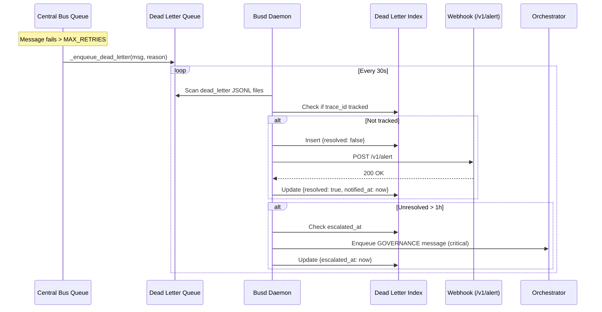
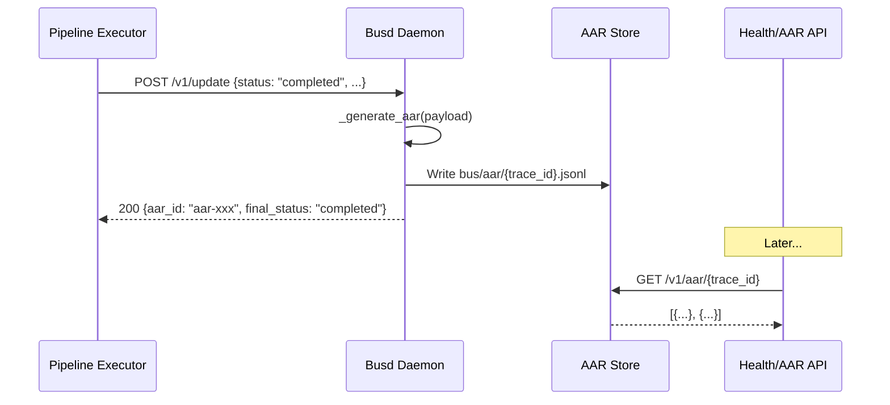

# Central Bus v0.6 — Orchestration Spec

> **Author:** วุฒิ (Wut) — Chief Orchestrator
> **Mandate:** เทอโบ (CEO) — D2 delivery
> **Status:** Draft · **Last Updated:** 2026-07-05
> **Target Release:** v0.6

---

## Table of Contents

1. [Alert Mechanism: Dead-Letter Queue](#1-alert-mechanism-dead-letter-queue)
2. [AAR Workflow (After Action Review)](#2-aar-workflow-after-action-review)
3. [Loop Migration Plan: pipeline_executor](#3-loop-migration-plan-pipeline_executor)
4. [Rollback Verification Procedure](#4-rollback-verification-procedure)

---

## 1. Alert Mechanism: Dead-Letter Queue

### 1.1 Problem Statement

When a message enters the dead-letter queue (`bus/queue/dead_letter/*.jsonl`), no one is notified. The only existing awareness is a passive stderr print in `monitor_watchdog.py:159-163` during watchdog runs. CEO mandates dead-letter alerts as **P0**.

### 1.2 Data Model

The dead-letter record format (current, in `queue.py:_enqueue_dead_letter`):

```json
{
  "message": { /* BusMessage.__dict__ */ },
  "reason": "Max retries exceeded",
  "retry_count": 4,
  "moved_at": "2026-07-05T10:30:00+00:00"
}
```

Existing fields lack a `resolved` flag. Add a `dead_letter` tracking table/file.

#### 1.2.1 Dead Letter Tracking Table

Add `bus/dead_letter/index.jsonl` for resolved tracking:

```
bus/
  dead_letter/
    index.jsonl          ← tracking: {id, trace_id, priority, reason, moved_at, resolved, resolved_at, notified_at}
```

Record schema:

```json
{
  "id": "dl-<uuid>",
  "trace_id": "abc-123",
  "priority": "high",
  "reason": "Max retries exceeded",
  "moved_at": "2026-07-05T10:30:00+00:00",
  "resolved": false,
  "resolved_at": null,
  "notified_at": null
}
```

### 1.3 Architecture: Busd Dead-Letter Detector

#### 1.3.1 Background Polling Task

**File:** `central_bus/busd.py` (new — the bus daemon process)

A background thread runs every 30 seconds:

```
def dead_letter_poller():
    while True:
        for priority in ("critical", "high", "normal", "low"):
            dl_path = DEAD_LETTER_DIR / f"{priority}.jsonl"
            if not dl_path.exists():
                continue
            with open(dl_path) as f:
                for line in f:
                    if not line.strip():
                        continue
                    record = json.loads(line)
                    msg = record["message"]
                    trace_id = msg.get("trace_id")
                    # Check index for existing entry
                    if not _is_tracked(trace_id):
                        _track(trace_id, record)
                        _notify(record)
        time.sleep(30)
```

**Detection Logic:**

1. Read every line in `bus/queue/dead_letter/{priority}.jsonl`
2. For each dead letter, check if its `trace_id` is already tracked in `bus/dead_letter/index.jsonl`
3. If **not tracked** — it is a new dead letter → trigger notification flow
4. Insert tracking record with `resolved: false`
5. After successful notification → mark `resolved: true`

#### 1.3.2 Notification Webhook

POST to configured webhook URL (default: `http://localhost:8765/v1/alert`):

```http
POST /v1/alert
Content-Type: application/json

{
  "alert_type": "dead_letter",
  "severity": "P0",
  "trace_id": "abc-123",
  "priority": "high",
  "reason": "Max retries exceeded",
  "retry_count": 4,
  "message": {
    "from_dept": "engineering",
    "to_dept": "qa",
    "type": "HANDOFF",
    "project_id": "bangkok-pos",
    "phase": "build"
  },
  "moved_at": "2026-07-05T10:30:00+00:00",
  "detected_at": "2026-07-05T10:30:15+00:00"
}
```

**Notification channels** (configurable via `DEAD_LETTER_NOTIFY_VIA` env):

| Channel | Mechanism | Default |
|---------|-----------|---------|
| `webhook` | POST to `/v1/alert` (or configured URL) | ✅ Yes |
| `stdout` | Print to stderr with `🔴 DEAD LETTER` prefix | ✅ Yes |
| `slack` | Slack webhook (future) | ❌ No |
| `telegram` | Telegram bot (future) | ❌ No |

#### 1.3.3 Busd Daemon Lifecycle

```
busd
  ├── Dead Letter Detector (thread, 30s poll)
  ├── AAR Generator (thread, hook into POST /v1/update — see §2)
  ├── Health Server (thread, HTTP :8766)
  └── (future) SSE stream for live dashboard
```

**Startup:**
```bash
python -m central_bus.busd        # production
python -m central_bus.busd --dev   # dev mode + verbose logging
```

**Process management:**
```bash
govctl busd start    # starts busd daemon
govctl busd stop     # graceful shutdown
govctl busd status   # check if running
```

Requires PID file management similar to bridge daemon (`~/.govctl/busd.pid`).

### 1.4 Health Endpoint

**Endpoint:** `GET /api/v1/health`

**Response** (enhanced from current):

```json
{
  "status": "ok",
  "service": "govctl-api",
  "version": "0.6.0",
  "dead_letter_count": 0,
  "busd": {
    "running": true,
    "uptime_seconds": 3600
  }
}
```

**When dead_letter_count > 0:**

```json
{
  "status": "degraded",
  "service": "govctl-api",
  "version": "0.6.0",
  "dead_letter_count": 3,
  "dead_letters": [
    {
      "trace_id": "abc-123",
      "priority": "high",
      "reason": "Max retries exceeded",
      "moved_at": "2026-07-05T10:30:00+00:00",
      "resolved": false,
      "age_seconds": 900
    }
  ],
  "busd": {
    "running": true,
    "uptime_seconds": 3600
  }
}
```

**Implementation:**
- `dead_letter_count = len([r for r in read_dead_letter_index() if not r['resolved']])`
- If `dead_letter_count > 0` → `status = "degraded"`
- Health endpoint reads `bus/dead_letter/index.jsonl` directly (O(n) for small n)

### 1.5 Escalation: 1-Hour Unresolved

If a dead letter remains `resolved=false` for > 1 hour, escalate to Orchestrator.

**Implementation in `dead_letter_poller()`:**

```python
def _check_escalation():
    now = datetime.now(timezone.utc)
    for record in _read_index():
        if record["resolved"]:
            continue
        moved_at = datetime.fromisoformat(record["moved_at"])
        if (now - moved_at).total_seconds() > 3600:  # 1 hour
            _broadcast_to_orchestrator(record)
            record["escalated_at"] = now.isoformat()
            _write_index(record)  # update in-place
```

**Broadcast mechanism:** Enqueue a `GOVERNANCE` message to the orchestrator:

```python
def _broadcast_to_orchestrator(dead_letter_record: dict):
    msg = BusMessage(
        from_dept="architect",
        to_dept="orchestrator",
        type="GOVERNANCE",
        project_id=dead_letter_record["message"]["project_id"],
        phase="ops",
        payload={
            "gov_event": "dead_letter_unresolved",
            "gov_detail": f"Dead letter {dead_letter_record['trace_id']} unresolved for >1h",
            "trace_id": dead_letter_record["trace_id"],
            "reason": dead_letter_record["reason"],
            "moved_at": dead_letter_record["moved_at"]
        },
        trace_id=dead_letter_record["trace_id"],
        priority="critical"
    )
    enqueue(msg)
```

### 1.6 Implementation Steps

| Step | File | Description |
|------|------|-------------|
| 1 | `central_bus/dead_letter.py` | New module: index read/write, poller, notifier, escalation |
| 2 | `central_bus/busd.py` | New module: daemon entry point, thread orchestration |
| 3 | `central_bus/queue.py` | Add `resolved` field to dead-letter record (backward-compatible) |
| 4 | `govctl_cli/` | Add `busd start/stop/status` commands |
| 5 | `govctl_cli/api/routes/monitoring.py` | Enhance `GET /api/v1/health` with dead_letter_count + busd status |

### 1.7 Configuration

```bash
# .env or config
DEAD_LETTER_NOTIFY_VIA=webhook,stdout
DEAD_LETTER_WEBHOOK_URL=http://localhost:8765/v1/alert
DEAD_LETTER_POLL_INTERVAL=30
DEAD_LETTER_ESCALATION_HOURS=1
BUSD_PORT=8766
```

---

## 2. AAR Workflow (After Action Review)

### 2.1 Problem Statement

When a pipeline run completes (successfully or fatally), there is no structured After Action Review. No record of total hops, retries, latency, or failure pattern exists. CEO mandates AAR as **P0**.

### 2.2 Data Model

#### 2.2.1 AAR Table

**File:** `bus/aar/{trace_id}.jsonl`

```
bus/
  aar/
    abc-123.jsonl          ← AAR entries for trace_id=abc-123
    def-456.jsonl
```

Each file is a JSONL of AAR entries, ordered by creation time.

**AAR Entry Schema:**

```json
{
  "aar_id": "aar-<uuid>",
  "trace_id": "abc-123",
  "task_id": "task-001",
  "queue_id": "high",
  "total_hops": 3,
  "total_retries": 1,
  "final_status": "completed",
  "latency_ms": 45200,
  "failure_pattern": null,
  "notes": null,
  "created_at": "2026-07-05T10:30:00+00:00"
}
```

**Fields:**

| Field | Type | Description |
|-------|------|-------------|
| `aar_id` | string | Unique ID (`aar-<uuid>`) |
| `trace_id` | string | Pipeline trace ID (from BusMessage) |
| `task_id` | string | Task identifier from payload |
| `queue_id` | string | Priority queue the message came from |
| `total_hops` | integer | `len(routing_hops)` or count of departments visited |
| `total_retries` | integer | `retry_count` from final message state |
| `final_status` | enum | `"completed"` or `"dead"` |
| `latency_ms` | integer | Milliseconds from `created_at` to completion |
| `failure_pattern` | string? | Null if success; short description if "dead" |
| `notes` | string? | Human review notes (set via POST notes endpoint) |
| `created_at` | string (ISO) | When AAR entry was generated |

### 2.3 AAR Generation Flow

#### 2.3.1 Trigger

AAR generation hooks into `POST /v1/update` — the endpoint that updates message status.

**Trigger conditions:**
1. `status == "completed"` — pipeline finished successfully
2. `retry_count >= max_retries` → final status `"dead"` — pipeline exhausted

#### 2.3.2 Hook Implementation

```python
# In POST /v1/update handler

@app.post("/v1/update")
async def update_message(payload: UpdateRequest):
    # ... existing update logic ...

    # AAR hook
    if payload.status == "completed" or payload.retry_count >= MAX_RETRIES:
        aar_entry = _generate_aar(payload)
        aar_id = _persist_aar(aar_entry)

        # Return aar_id in response
        return {
            "status": "ok",
            "aar_id": aar_id,
            "final_status": aar_entry["final_status"]
        }

    return {"status": "ok"}
```

#### 2.3.3 AAR Generation Function

```python
def _generate_aar(payload: UpdateRequest) -> dict:
    msg = _get_message(payload.trace_id)  # fetch original BusMessage

    # Calculate fields
    total_hops = len(payload.routing_hops) if payload.routing_hops else 0
    total_retries = payload.retry_count
    latency_ms = int((datetime.now(timezone.utc) - msg.created_at).total_seconds() * 1000)
    final_status = "dead" if payload.retry_count >= MAX_RETRIES else "completed"
    failure_pattern = (
        _derive_failure_pattern(payload)
        if final_status == "dead"
        else None
    )

    return {
        "aar_id": f"aar-{uuid.uuid4()}",
        "trace_id": payload.trace_id,
        "task_id": msg.payload.get("task_id", ""),
        "queue_id": msg.priority,
        "total_hops": total_hops,
        "total_retries": total_retries,
        "final_status": final_status,
        "latency_ms": latency_ms,
        "failure_pattern": failure_pattern,
        "notes": None,
        "created_at": datetime.now(timezone.utc).isoformat()
    }
```

#### 2.3.4 Response from POST /v1/update

```json
{
  "status": "ok",
  "aar_id": "aar-<uuid>",
  "final_status": "completed"
}
```

### 2.4 GET /v1/aar/{trace_id}

**Endpoint:** `GET /v1/aar/{trace_id}`
**Response:** All AAR entries for that trace_id, ordered by `created_at DESC`.

```json
[
  {
    "aar_id": "aar-abc-001",
    "trace_id": "abc-123",
    "task_id": "task-001",
    "queue_id": "high",
    "total_hops": 3,
    "total_retries": 1,
    "final_status": "completed",
    "latency_ms": 45200,
    "failure_pattern": null,
    "notes": null,
    "created_at": "2026-07-05T10:30:00+00:00"
  }
]
```

**Implementation:**

```python
@app.get("/v1/aar/{trace_id}")
async def get_aar(trace_id: str):
    path = AAR_DIR / f"{trace_id}.jsonl"
    if not path.exists():
        return []
    entries = []
    for line in reversed(path.read_text().splitlines()):
        if line.strip():
            entries.append(json.loads(line))
    return entries  # already reversed (DESC by file order)
```

### 2.5 POST /v1/aar/{aar_id}/notes (P2)

**Endpoint:** `POST /v1/aar/{aar_id}/notes`
**Purpose:** Allow human reviewers to add notes to an AAR entry.

```json
// Request
{
  "notes": "Investigated — QA gate failed due to missing test coverage. Re-queued."
}

// Response
{
  "status": "ok",
  "aar_id": "aar-abc-001",
  "notes_updated": true
}
```

**Implementation:** Read the AAR JSONL file, find the matching `aar_id` entry, update `notes` field, rewrite the file.

### 2.6 Max Retries Configuration

Current value in `queue.py:MAX_RETRIES = 3`. For v0.6, make this configurable:

```python
# queue.py
MAX_RETRIES = int(os.environ.get("CENTRAL_BUS_MAX_RETRIES", "3"))
```

### 2.7 Implementation Steps

| Step | File | Description |
|------|------|-------------|
| 1 | `central_bus/aar.py` | New module: AAR generation, persist, read, notes update |
| 2 | `central_bus/busd.py` | Hook AAR generator into POST /v1/update handler |
| 3 | API routes | Add `GET /v1/aar/{trace_id}`, `POST /v1/aar/{aar_id}/notes` |
| 4 | `central_bus/queue.py` | Make MAX_RETRIES env-configurable |

---

## 3. Loop Migration Plan: pipeline_executor

### 3.1 Migration Scope per CEO Mandate

| Loop | Priority | Target Sprint |
|------|----------|---------------|
| **pipeline_executor** | **P0** | **v0.6 Sprint 1** |
| daily_brief | P2 | Deferred to v2.6 |
| subscription_audit | P2 | Deferred to v2.6 |
| brain_auto_commit | P2 | Deferred to v2.6 |

### 3.2 Current Architecture

**File:** `loop_runner/loops/pipeline_executor.py`

Current flow:
```python
# pipeline_executor.py (current)
from central_bus import queue, state

class PipelineExecutorLoop(Loop):
    def run(self):
        msg = queue.dequeue(priority)   # ← DIRECT import + function call
        result = self._dispatch(msg)
```

Problems:
1. Tight coupling to `central_bus.queue` module
2. No HTTP abstraction — cannot run busd separately
3. No observability at the HTTP layer
4. Cannot scale to distributed busd

### 3.3 Target Architecture

```
┌──────────────────┐     HTTP POST /v1/observe     ┌──────────────────┐
│  pipeline_executor│ ─────────────────────────────▶│  busd (HTTP)     │
│  (loop_runner)    │                               │  :8766           │
│                   │◀───────────────────────────── │                  │
│  HTTP client      │     HTTP POST /v1/update      │  Central Bus     │
│  (httpx)          │                               │  (queue, state)  │
└──────────────────┘                               └──────────────────┘
```

### 3.4 Migration Steps

#### Step A: Add HTTP Client Wrapper in loop_runner

**File:** `loop_runner/busd_client.py` (new)

```python
"""HTTP client for busd — replaces direct central_bus.queue imports."""

import httpx
import os
from typing import Optional

BUSD_BASE_URL = os.environ.get(
    "BUSD_BASE_URL", "http://localhost:8766"
)
USE_BUSD_HTTP = os.environ.get("USE_BUSD_HTTP", "False").lower() == "true"


class BusdClient:
    """Thin HTTP wrapper around busd REST API."""

    def __init__(self, base_url: str = BUSD_BASE_URL):
        self.base_url = base_url.rstrip("/")
        self._client = httpx.Client(timeout=30)

    def observe(self, priority: str) -> Optional[dict]:
        """POST /v1/observe — peek next message without consuming."""
        resp = self._client.post(
            f"{self.base_url}/v1/observe",
            json={"priority": priority}
        )
        if resp.status_code == 204:
            return None
        resp.raise_for_status()
        return resp.json()

    def update(self, trace_id: str, status: str, retry_count: int,
               routing_hops: Optional[list] = None) -> dict:
        """POST /v1/update — report completion/failure back to busd."""
        payload = {
            "trace_id": trace_id,
            "status": status,
            "retry_count": retry_count,
            "routing_hops": routing_hops or [],
        }
        resp = self._client.post(
            f"{self.base_url}/v1/update",
            json=payload
        )
        resp.raise_for_status()
        return resp.json()

    def close(self):
        self._client.close()
```

#### Step B: Replace Direct Queue Calls with HTTP

**File:** `loop_runner/loops/pipeline_executor.py` (modified)

```
Current:                          Target:
──────────────────────────────────────────────────────
from central_bus import queue     from loop_runner.busd_client import BusdClient, USE_BUSD_HTTP

msg = queue.dequeue(priority)     if USE_BUSD_HTTP:
                                    client = BusdClient()
                                    msg_data = client.observe(priority)
                                    if msg_data:
                                        client.update(...)
                                  else:
                                    msg = queue.dequeue(priority)
```

**Full modified `run()` method:**

```python
from ..busd_client import BusdClient, USE_BUSD_HTTP

def run(self) -> str:
    executed = []
    for priority in ("high", "normal"):
        while len(executed) < MAX_TASKS_PER_RUN:
            msg = self._dequeue(priority)
            if not msg:
                break
            result = self._dispatch(msg)
            executed.append(...)
    ...

def _dequeue(self, priority: str) -> BusMessage | None:
    if USE_BUSD_HTTP:
        client = BusdClient()
        try:
            data = client.observe(priority)
            if data is None:
                return None
            return BusMessage(**data["message"])
        finally:
            client.close()
    else:
        return queue.dequeue(priority)

def _complete(self, msg: BusMessage, status: str, retry_count: int):
    if USE_BUSD_HTTP:
        client = BusdClient()
        try:
            client.update(msg.trace_id, status, retry_count)
        finally:
            client.close()
    else:
        # Old behavior: just log
        pass
```

#### Step C: Busd `/v1/observe` and `/v1/update` Endpoints

**File:** `central_bus/busd.py` (add FastAPI routes)

```python
# Routes added to busd (FastAPI app or embedded in busd.py)

@app.post("/v1/observe")
async def observe(payload: ObserveRequest):
    """Peek next message from queue without consuming.
    Returns 204 No Content if queue is empty.
    """
    msg = queue.dequeue(payload.priority)
    if msg is None:
        return Response(status_code=204)

    return {
        "message": msg.__dict__,
        "queue_depth": _queue_depth(payload.priority)
    }


@app.post("/v1/update")
async def update(payload: UpdateRequest):
    """Report message completion or failure.
    Triggers AAR generation on completed/dead status.
    """
    # Process completion
    if payload.status == "completed":
        # AAR hook
        aar_entry = _generate_aar(payload)
        aar_id = _persist_aar(aar_entry)
        return {
            "status": "ok",
            "aar_id": aar_id,
            "final_status": "completed"
        }
    elif payload.retry_count >= MAX_RETRIES:
        # Dead — AAR with failure pattern
        aar_entry = _generate_aar(payload)
        aar_id = _persist_aar(aar_entry)
        return {
            "status": "ok",
            "aar_id": aar_id,
            "final_status": "dead"
        }

    return {"status": "ok"}
```

#### Step D: Test with Busd Running Locally

```bash
# Terminal 1: Start busd
python -m central_bus.busd --dev

# Terminal 2: Run loop with HTTP mode
USE_BUSD_HTTP=True python -m loop_runner.main
```

**Test scenarios:**

| # | Scenario | Steps | Expected |
|---|----------|-------|----------|
| 1 | Queue empty | `curl -X POST :8766/v1/observe -d '{"priority":"high"}'` | 204 No Content |
| 2 | Message available | Enqueue first, then observe | 200 + message body |
| 3 | Complete message | POST /v1/update with status=completed | 200 + aar_id |
| 4 | Dead message | POST /v1/update with retry_count >= MAX_RETRIES | 200 + aar_id + "dead" |
| 5 | Rollback toggle | `USE_BUSD_HTTP=False` | Falls back to direct queue imports |

#### Step E: Cut Over

1. Deploy busd as systemd service (or managed process)
2. Set `USE_BUSD_HTTP=True` in production env
3. Keep old direct-import path as fallback for 1 sprint
4. Remove old path in v0.7

### 3.5 Busd Routes Summary

| Method | Path | Purpose | Request | Response |
|--------|------|---------|---------|----------|
| POST | `/v1/observe` | Peek next message | `{"priority": "high"}` | `{"message": {...}}` or 204 |
| POST | `/v1/update` | Report status + trigger AAR | `{"trace_id", "status", "retry_count", "routing_hops"}` | `{"status": "ok", "aar_id": "..."}` |
| GET | `/v1/health` | Busd health + dead_letter_count | — | `{"status": "ok", "dead_letter_count": 0}` |
| GET | `/v1/aar/{trace_id}` | Get AAR entries | — | `[{...}]` |
| POST | `/v1/aar/{aar_id}/notes` | Add human notes | `{"notes": "..."}` | `{"status": "ok"}` |

### 3.6 Rollback: Toggle Flag

```python
# loop_runner/busd_client.py
USE_BUSD_HTTP = os.environ.get("USE_BUSD_HTTP", "False").lower() == "true"
```

**To rollback:**
```bash
export USE_BUSD_HTTP=False
# Restart loop_runner — immediately reverts to direct queue imports
```

**Safety:** The toggle is checked per-dequeue operation, not cached at import time. This means rollback takes effect on the next loop iteration without restart.

---

## 4. Rollback Verification Procedure

### 4.1 Prerequisites

Before any rollback:
1. Confirm `USE_BUSD_HTTP=False` is effective
2. Confirm busd is NOT required for basic queue operations
3. Existing dead letters remain readable via `list_dead_letters()`
4. AAR data persists in `bus/aar/` and is accessible via direct file read

### 4.2 Verification Script

```bash
#!/usr/bin/env bash
# rollback-verify.sh — verify rollback readiness

echo "=== Rollback Verification ==="

# 1. Toggle flag
echo "[1/4] Toggle flag effective:"
USE_BUSD_HTTP=False python -c "
from loop_runner.busd_client import USE_BUSD_HTTP
assert USE_BUSD_HTTP == False, 'Toggle not working'
print('  ✅ USE_BUSD_HTTP=False works')
"

# 2. Direct queue import still works
echo "[2/4] Direct queue import:"
python -c "
from central_bus.queue import enqueue, dequeue
from central_bus.models import BusMessage
msg = BusMessage(
    from_dept='orchestrator', to_dept='qa',
    type='HANDOFF', project_id='rollback-test',
    phase='verify', payload={'text': 'rollback test'},
    trace_id='rollback-verify'
)
enqueue(msg)
m = dequeue('normal')
assert m is not None, 'dequeue failed'
print('  ✅ Direct queue import works')
"

# 3. Dead letters readable
echo "[3/4] Dead letter readability:"
python -c "
from central_bus.queue import list_dead_letters
dl = list_dead_letters()
print(f'  ✅ Dead letters: {len(dl)} entries readable')
"

# 4. AAR data persists
echo "[4/4] AAR data persistence:"
python -c "
from pathlib import Path
aar_dir = Path('bus/aar')
if aar_dir.exists():
    files = list(aar_dir.glob('*.jsonl'))
    print(f'  ✅ AAR files: {len(files)} entries intact')
else:
    print('  ℹ️  No AAR files yet (expected for fresh deployment)')
"

echo "=== Rollback verification complete ==="
```

### 4.3 Rollback Execution

```bash
# Step 1: Set toggle
export USE_BUSD_HTTP=False

# Step 2: Verify queue operations
python -c "
from central_bus.queue import list_dead_letters
from central_bus.models import BusMessage
# Test basic operations
msg = BusMessage(from_dept='architect', to_dept='engineering',
    type='HANDOFF', project_id='test', phase='test',
    payload={'text': 'rollback test'}, trace_id='rb-test')
from central_bus.queue import enqueue, dequeue
enqueue(msg)
assert dequeue('normal') is not None
print('Queue operations OK')
"

# Step 3: Run loop_runner once to confirm
python -m loop_runner.main --once

# Step 4: (Optional) Stop busd
govctl busd stop

# Step 5: Confirm health endpoint
curl http://localhost:8765/api/v1/health | python -m json.tool
# Expected: status "ok" (may show "degraded" if dead_letter_count > 0)
```

### 4.4 Rollback Success Criteria

| Criterion | Method | Expected |
|-----------|--------|----------|
| Queue dequeue works | `dequeue('normal')` | Returns message |
| Loop runs without busd | `python -m loop_runner.main --once` | No HTTP connection errors |
| Health endpoint responds | `curl :8765/api/v1/health` | HTTP 200 |
| Dead letters accessible | `list_dead_letters()` | No exceptions |
| AAR data preserved | `ls bus/aar/*.jsonl` | Files unchanged |

---

## Appendix A: File Map

### New Files

| File | Purpose | Owner |
|------|---------|-------|
| `central_bus/dead_letter.py` | Dead letter index, poller, notifier, escalation | Engineering |
| `central_bus/busd.py` | Bus daemon entry point, routes, thread orchestration | Engineering |
| `central_bus/aar.py` | AAR generation, persist, query, notes | Engineering |
| `loop_runner/busd_client.py` | HTTP client wrapper, USE_BUSD_HTTP toggle | Engineering |

### Modified Files

| File | Change | Owner |
|------|--------|-------|
| `loop_runner/loops/pipeline_executor.py` | Add HTTP path behind USE_BUSD_HTTP toggle | Engineering |
| `central_bus/queue.py` | Make MAX_RETRIES env-configurable | Engineering |
| `govctl_cli/bridge.py` (or new `ops.py`) | Add `busd start/stop/status` commands | Engineering |
| `govctl_cli/api/routes/monitoring.py` | Enhance health endpoint with dead_letter_count + busd status | Engineering |

### New Data Files

| Path | Format | Purpose |
|------|--------|---------|
| `bus/dead_letter/index.jsonl` | JSONL | Dead letter tracking with resolved flag |
| `bus/aar/{trace_id}.jsonl` | JSONL | AAR entries per trace ID |

---

## Appendix B: Env Configuration

```bash
# ── Busd ──────────────────────────────────────────
BUSD_PORT=8766
BUSD_HOST=0.0.0.0

# ── Dead Letter ───────────────────────────────────
DEAD_LETTER_NOTIFY_VIA=webhook,stdout
DEAD_LETTER_WEBHOOK_URL=http://localhost:8765/v1/alert
DEAD_LETTER_POLL_INTERVAL=30
DEAD_LETTER_ESCALATION_HOURS=1

# ── AAR ───────────────────────────────────────────
CENTRAL_BUS_MAX_RETRIES=3

# ── Loop Runner Migration ─────────────────────────
USE_BUSD_HTTP=False          # Toggle: True = HTTP to busd, False = direct import
BUSD_BASE_URL=http://localhost:8766
```

---

## Appendix C: Mermaid Sequence — Dead Letter Flow



---

## Appendix D: Mermaid Sequence — AAR Flow



---

*End of Orchestration Spec v0.6 — For implementation questions, contact พี่วุฒิ (Orchestrator)*
