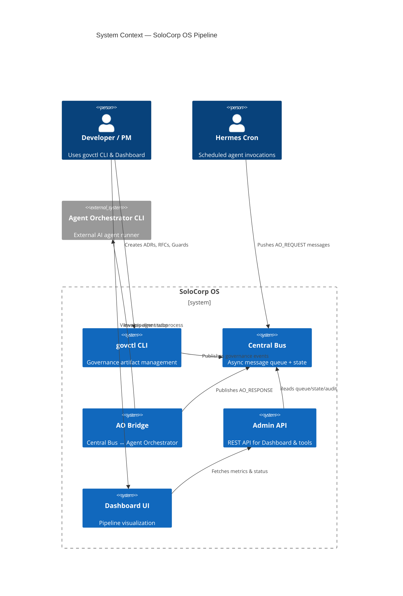
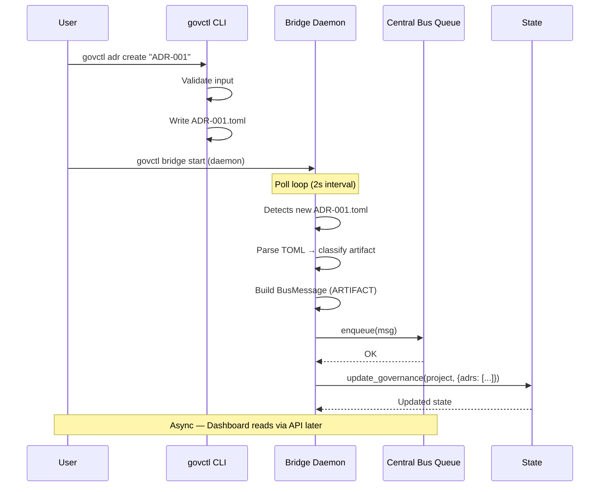
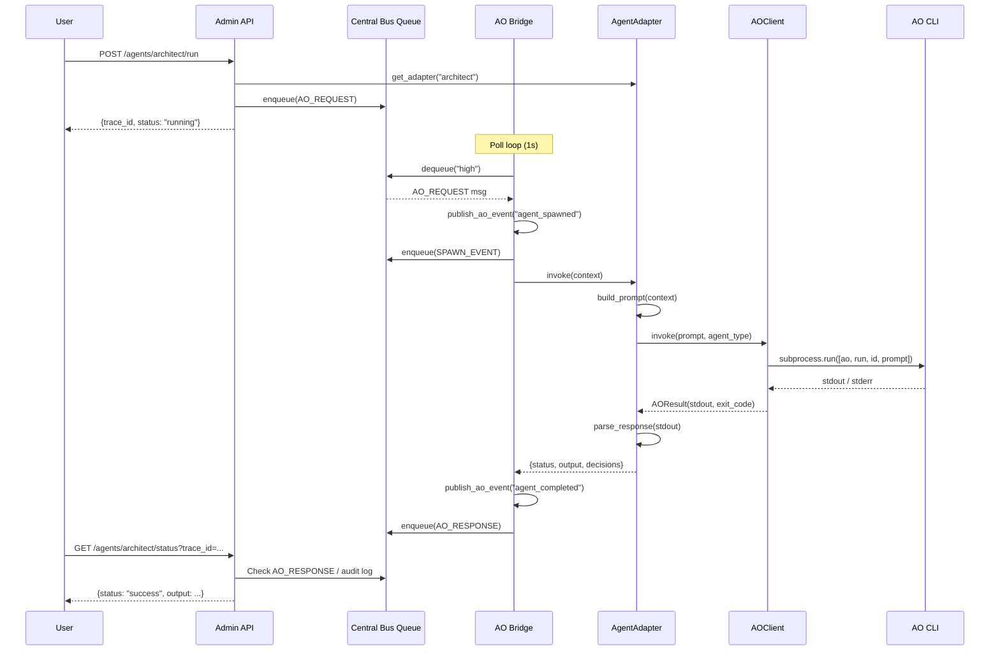
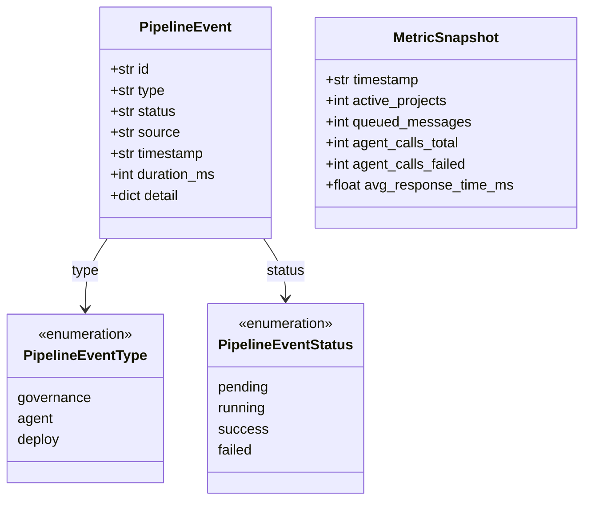

# SoloCorp OS — E2E Pipeline Architecture

> **Author:** Software Architect (พี่ทรงศักดิ์) · **Phase:** 3-4 Pipeline + API Design
> **Status:** Accepted · **Last Updated:** 2026-07-05

---

## Table of Contents

1. [System Context](#1-system-context)
2. [Component Architecture](#2-component-architecture)
3. [Data Flow Specifications](#3-data-flow-specifications)
4. [Monitoring Data Model](#4-monitoring-data-model)
5. [API Design Rationale](#5-api-design-rationale)
6. [Deployment Topology](#6-deployment-topology)
7. [Trade-off Analysis](#7-trade-off-analysis)

---

## 1. System Context

### C4 Level 1 — System Context Diagram



### Core Flow — End to End

```
  ┌──────────┐     ┌──────────┐     ┌─────────────┐     ┌───────────┐
  │  User    │────▶│ govctl   │────▶│ Central Bus │────▶│ AO Bridge │
  │ (CLI)    │     │ CLI      │     │ (queue.jsonl)│     │ (poll)    │
  └──────────┘     └──────────┘     └─────────────┘     └─────┬─────┘
                                                              │
                                                              ▼
                                                     ┌───────────────┐
                                                     │ Agent         │
                                                     │ Orchestrator  │
                                                     │ CLI (subproc) │
                                                     └───────┬───────┘
                                                             │
                  ┌──────────────┐     ┌─────────────┐       │
                  │ Dashboard UI │◀────│ Admin API   │       │
                  │ (MVP)        │     │ (FastAPI)   │       │
                  └──────────────┘     └──────┬──────┘       │
                                              │              │
                                              ▼              ▼
                                     ┌──────────────────────────┐
                                     │      Central Bus         │
                                     │  (state.json + audit)    │
                                     └──────────────────────────┘
```

---

## 2. Component Architecture

### C4 Level 2 — Component Diagram

```mermaid
C4Container
  title Container Diagram — SoloCorp OS Pipeline Components

  Person(user, "User", "Dev/PM")
  System_Ext(ao_cli_ext, "Agent Orchestrator", "AI agent subprocess")

  Container(govctl_cli, "govctl CLI", "Python Typer",
    "CLI for governance artifacts, AO agent commands, bridge management")

  Boundary(central_bus_b, "Central Bus") {
    Container(queue, "Queue", "JSONL files",
      "Priority-based message queue (critical/high/normal/low)")
    Container(state, "Project State", "JSON files",
      "Per-project phase, guard, governance state machine")
    Container(audit, "Audit Log", "JSONL files",
      "Immutable message audit trail, date-partitioned")
    Container(dashboard_ds, "Dashboard Data", "Python module",
      "Aggregated project summaries for rendering")
  }

  Boundary(ao_module, "AO Module") {
    Container(adapters, "Agent Adapters", "Python ABC",
      "5 concrete adapters: ceo, orchestrator, architect, engineering, qa")
    Container(client, "AO Client", "Python subprocess",
      "Shell wrapper for AO CLI invocation + retry logic")
    Container(bridge, "Bridge Integration", "Python thread",
      "Central Bus ↔ AO bridge: poll, spawn, publish")
  }

  Container(admin_api, "Admin API", "FastAPI",
    "REST API for governance CRUD, agent execution, pipeline status")

  Rel(user, govctl_cli, "govctl adr/rfc/guard/ao")
  Rel(govctl_cli, state, "Reads/writes project state")
  Rel(govctl_cli, queue, "Publishes governance events via bridge")

  Rel(queue, bridge, "AO Bridge polls AO_REQUEST messages")
  Rel(bridge, adapters, "Looks up adapter by agent_id")
  Rel(adapters, client, "AOClient.invoke() → subprocess")
  Rel(client, ao_cli_ext, "Spawns agent_orchestrator CLI")
  Rel(bridge, queue, "Publishes AO_RESPONSE")

  Rel(admin_api, state, "Reads project state")
  Rel(admin_api, queue, "Reads queue depth, metrics")
  Rel(admin_api, audit, "Reads audit trail")
```

### Layer Architecture

```
┌─────────────────────────────────────────────────────────────┐
│                        Presentation                         │
│    govctl CLI (Typer)    │  vanilla HTML/CSS/JS dashboard   │
│    govctl_cli/cli.py     │    central_bus/dashboard.py      │
└─────────────────────────────────────────────────────────────┘
                           │
┌─────────────────────────────────────────────────────────────┐
│                        API Layer                            │
│    Admin REST API (FastAPI) — govctl_cli/api/               │
│    Routes: governance, agents, pipeline, monitoring         │
│    Auth: API key / mTLS (future)                            │
└─────────────────────────────────────────────────────────────┘
                           │
┌─────────────────────────────────────────────────────────────┐
│                     Application Logic                        │
│  ┌──────────────┐  ┌──────────────┐  ┌──────────────────┐   │
│  │ govctl CLI   │  │ AO Bridge    │  │ Monitor Watchdog │   │
│  │ governance   │  │ poll→spawn→  │  │ event routing    │   │
│  │ artifact mgmt│  │ respond      │  │ department notify│   │
│  └──────────────┘  └──────────────┘  └──────────────────┘   │
└─────────────────────────────────────────────────────────────┘
                           │
┌─────────────────────────────────────────────────────────────┐
│                          Data Layer                          │
│  ┌──────────────────────────────────────────────────────┐   │
│  │  Central Bus (file-based JSONL)                      │   │
│  │  ┌──────────┐  ┌──────────┐  ┌──────────────────┐   │   │
│  │  │ Queue    │  │ State    │  │ Audit            │   │   │
│  │  │ high.jsonl│  │ project/│  │ project/audit/   │   │   │
│  │  │ normal   │  │ state.json│ │ YYYY-MM-DD.jsonl │   │   │
│  │  └──────────┘  └──────────┘  └──────────────────┘   │   │
│  └──────────────────────────────────────────────────────┘   │
│  ┌──────────────────────────────────────────────────────┐   │
│  │  Gov Artifacts (TOML files)                          │   │
│  │  gov/adr/ADR-001.toml, gov/rfc/RFC-001.toml         │   │
│  │  gov/guards/passing.toml, gov/config.toml            │   │
│  └──────────────────────────────────────────────────────┘   │
└─────────────────────────────────────────────────────────────┘
```

### Module Dependency Graph

```
govctl_cli/
  cli.py ─────────────────────────────────────────┐
   ├── adr.py ───▶ gov/adr/*.toml                 │
   ├── rfc.py ────▶ gov/rfc/*.toml                 │
   ├── guard.py ──▶ gov/guards/*.toml              │
   ├── bridge.py ─▶ central_bus/queue.py           │
   │                central_bus/models.py           │
   │    └── ao/ ───────────────────────────────────┤
   │         ├── adapter.py ←── agents/*.py        │
   │         ├── client.py (subprocess→AO CLI)     │
   │         └── bridge_integration.py             │
   ├── api/ ──────────────────────────────────────┤
   │    ├── routes/governance.py                   │
   │    ├── routes/agents.py                       │
   │    ├── routes/pipeline.py                     │
   │    └── routes/monitoring.py                   │
   └── ao_cmd.py                                   │
                                                    │
central_bus/                                        │
  ├── models.py — BusMessage dataclass              │
  ├── queue.py — JSONL enqueue/dequeue              │
  ├── state.py — Project state machine              │
  ├── audit.py — Immutable event log                │
  └── monitor_watchdog.py ─── Notify departments    │
                                                    ▼
                                              bus/
                                              queue/ *.jsonl
                                              projects/*/state.json
```

---

## 3. Data Flow Specifications

### 3.1 Governance Artifact Creation

```
govctl adr create
  │
  ├── 1. User runs:  govctl adr create --title "..." --status proposed
  │
  ├── 2. adr.py writes: gov/adr/ADR-001.toml
  │     └── File: [metadata], [context], [decision], [consequences]
  │
  ├── 3. bridge.py detects file change (poll: 2s)
  │     ├── Parse TOML → classify artifact type
  │     ├── Detect event (adr_created / adr_accepted / adr_superseded)
  │     └── Build BusMessage:
  │           type:    "ARTIFACT"
  │           payload: { gov_event, artifact_id, title, status, ... }
  │
  ├── 4. central_bus.queue.enqueue(msg) → bus/queue/normal.jsonl
  │
  └── 5. central_bus.state.init_project() / update_governance()
           └── Updates bus/projects/{id}/state.json
```

**Sequence Diagram:**



### 3.2 Agent Execution Flow

```
Admin API / CLI → AO_REQUEST → AO Bridge → Agent → AO_RESPONSE → Dashboard
```

```
POST /api/v1/agents/{id}/run
  │
  ├── 1. API receives: { "project_id": "PRJ-1", "context": {...} }
  │
  ├── 2. Look up adapter from REGISTRY
  │     └── Get AgentAdapter subclass for agent_id
  │
  ├── 3. Build BusMessage:
  │     type: "AO_REQUEST"
  │     payload: { agent_id, context, prompt, timeout }
  │
  ├── 4. enqueue(msg) → bus/queue/high.jsonl
  │
  ├── 5. AO Bridge (ao_listener_loop) polls queue
  │     ├── Dequeue AO_REQUEST
  │     ├── publish_ao_event("agent_spawned")
  │     ├── adapter.invoke(context)
  │     │    ├── build_prompt(context) → prompt string
  │     │    ├── AOClient.invoke(prompt) → subprocess
  │     │    │    └── agent_orchestrator run {agent_id} --prompt "..."
  │     │    └── parse_response(stdout) → structured dict
  │     ├── publish_ao_event("agent_completed" / "agent_failed")
  │     └── enqueue(AO_RESPONSE) → bus/queue/normal.jsonl
  │
  └── 6. API returns: { "trace_id": "...", "status": "running" }
           (Async — client polls status via trace_id)
```

**Sequence Diagram:**



### 3.3 Pipeline Status Check

```
GET /api/v1/pipeline/status?project_id=PRJ-1
  │
  ├── 1. API calls central_bus.state.get(project_id)
  │     └── Reads: bus/projects/PRJ-1/state.json
  │
  ├── 2. API calls central_bus.dashboard.summary(project_id)
  │     └── Computes: progress %, phase statuses, blockers
  │
  ├── 3. API reads queue depths:
  │     ├── Count lines in bus/queue/{priority}.jsonl
  │     ├── Count dead letters
  │     └── Compute backlog by priority
  │
  ├── 4. API reads recent audit events:
  │     └── central_bus.audit.read(project_id)
  │
  └── 5. Returns aggregated:
        { project, phase, progress, blockers,
          queue_depth, last_events, updated_at }
```

---

## 4. Monitoring Data Model

### 4.1 Event Taxonomy



### 4.2 Event Types & Payloads

| Event Type | Trigger | Payload Fields |
|---|---|---|
| `governance.adr_created` | New ADR written | `{ artifact_id, title, status, domain, impact }` |
| `governance.adr_accepted` | ADR promoted to accepted | `{ artifact_id, author, date }` |
| `governance.rfc_created` | New RFC submitted | `{ artifact_id, title, status, complexity }` |
| `governance.guard_run` | Guard check triggered | `{ guard_name, project, phase }` |
| `governance.guard_failed` | Guard check failed | `{ guard_name, reason, detail }` |
| `agent.agent_spawned` | AO agent invoked | `{ agent_id, trace_id, prompt_preview }` |
| `agent.agent_completed` | Agent returned success | `{ agent_id, trace_id, elapsed, output_size }` |
| `agent.agent_failed` | Agent returned error | `{ agent_id, trace_id, elapsed, return_code }` |
| `deploy.phase_transition` | Phase status changed | `{ project, phase, from, to, blocker }` |

### 4.3 Metrics Collection Points

```
┌────────────────────────────────────────────────────────┐
│                  Metrics Sources                        │
├────────────────────────────────────────────────────────┤
│ Queue Depth        │ bus/queue/{priority}.jsonl LINE count │
│ Project Count      │ bus/projects/ dir count            │
│ Agent Latency      │ AOResult.elapsed from every call   │
│ Agent Error Rate   │ result.success == False / total    │
│ Queue Throughput   │ JSONL lines consumed per minute    │
│ Dead Letter Rate   │ bus/queue/dead_letter/*.jsonl      │
└────────────────────────────────────────────────────────┘
```

### 4.4 Monitoring File Layout

```
bus/
  metrics/
    events.jsonl        ← PipelineEvent log (append-only)
    snapshots.jsonl     ← MetricSnapshot log (time-series)
    counters.json       ← Latest counter values (atomic)
  queue/
    critical.jsonl
    high.jsonl
    normal.jsonl
    low.jsonl
    dead_letter/
      critical.jsonl
      high.jsonl
      normal.jsonl
      low.jsonl
  projects/
    {project_id}/
      state.json
      audit/
        2026-07-05.jsonl
        2026-07-06.jsonl
      guard_events.jsonl
```

### 4.5 Pipeline Health Calculation

```python
# Health score = weighted composite of:
# - Queue health:   (1 - dead_letter_ratio) * 0.25
# - Agent health:   (1 - agent_failure_rate) * 0.35
# - Throughput:     min(current_tps / expected_tps, 1) * 0.20
# - Staleness:      (1 - projects_in_failed / total_projects) * 0.20
```

---

## 5. API Design Rationale

### 5.1 Design Principles

1. **Resource-oriented** — Every governance artifact is a resource with standard CRUD
2. **Async by default** — Agent execution returns immediately with a trace_id; status is polled
3. **Observability built-in** — Every endpoint returns timing and tracing headers
4. **Consistency over convenience** — Writes go through Central Bus for audit trail, not direct file mutation

### 5.2 Endpoint Categorization

| Category | Base Path | Auth Required | Caching |
|---|---|---|---|
| Governance | `/api/v1/gov/*` | Yes | Short (30s) for reads |
| Agent | `/api/v1/agents/*` | Yes | None |
| Pipeline | `/api/v1/pipeline/*` | Yes | Short (15s) |
| Monitoring | `/api/v1/metrics`, `/api/v1/health` | No (read-only) | Varies |

### 5.3 Async Agent Execution Pattern

```
POST /api/v1/agents/{id}/run
  → 202 Accepted
  → Location: /api/v1/agents/{id}/status?trace_id={trace_id}
  → Body: { trace_id, status: "pending", check_url: "..." }

GET /api/v1/agents/{id}/status?trace_id=...
  → 200 OK
  → Body: { trace_id, status: "running"|"success"|"failed", output, elapsed }
```

### 5.4 Error Response Format

All endpoints return consistent error structure:

```json
{
  "error": {
    "code": "AGENT_NOT_FOUND",
    "message": "Agent 'designer' is not registered",
    "details": {
      "available": ["ceo", "orchestrator", "architect", "engineering", "qa"]
    }
  },
  "trace_id": "abc-123"
}
```

---

## 6. Deployment Topology

### Development (Single Machine)

```
┌──────────────────────────────────────────┐
│  localhost                                │
│                                           │
│  govctl CLI (terminal)                    │
│       │                                   │
│  Bridge Daemon (background PID daemon)    │
│       │                                   │
│  Admin API (uvicorn :8765)                │
│       │                                   │
│  Dashboard (dev server :3000)             │
│       │                                   │
│  Agent Orchestrator (external binary)     │
│                                           │
│  bus/ (file system)                       │
│  gov/ (file system)                       │
└──────────────────────────────────────────┘
```

### Production (Future)

```
┌──────────┐  ┌──────────┐  ┌──────────┐
│  govctl  │  │  Admin   │  │  Agent   │
│  Bridge  │  │  API x2  │  │  Worker  │
│  Daemon  │  │(replica) │  │  Pool    │
└────┬─────┘  └────┬─────┘  └────┬─────┘
     │              │              │
     └──────────────┼──────────────┘
                    ▼
          ┌──────────────────┐
          │  Central Bus     │
          │  (NFS/Distributed│
          │   file system)   │
          └──────────────────┘
```

---

## 7. Trade-off Analysis

### Decision: File-based JSONL vs RDBMS

| Factor | JSONL (chosen) | SQLite/Postgres |
|---|---|---|
| **Dependencies** | None (stdlib) | Extra package |
| **Setup** | Zero (directory creates itself) | Migration scripts |
| **Backup** | `cp -r bus/` | `pg_dump` |
| **Consistency** | fcntl.LOCK_EX | ACID transactions |
| **Queryability** | grep + jq | SQL |
| **Scalability** | Single-node only | Horizontal possible |

**Rationale:** Stay file-based for Phase 3-4. The SoloCorp OS is single-node/mono-user. JSONL gives us append-only audit (immutable), simple debugging (`cat bus/queue/normal.jsonl`), and zero operational overhead.

### Decision: FastAPI vs Flask vs Embedded

| Factor | FastAPI (chosen) | Flask | Embedded in CLI |
|---|---|---|---|
| **Performance** | Async, auto | Sync | N/A |
| **OpenAPI** | Automatic generation | Manual | Not needed |
| **Dev speed** | Fast with pydantic | Not bad | Fastest |
| **Use case fit** | Dashboard API | General web | CLI-only |

**Rationale:** FastAPI gives us automatic OpenAPI spec generation (docs at `/docs`), Pydantic validation re-use with our models, async support for polling Central Bus without blocking, and future-proofing for multi-user access.

---

## Appendix: Port & URL Map

| Service | Protocol | Port | Path |
|---|---|---|---|
| Admin API | HTTP | 8765 | `http://localhost:8765` |
| API Docs | HTTP | 8765 | `http://localhost:8765/docs` |
| API ReDoc | HTTP | 8765 | `http://localhost:8765/redoc` |
| Dashboard (dev) | HTTP | 3000 | `http://localhost:3000` |
| AO CLI | subprocess | — | `agent_orchestrator` |
| Central Bus | file | — | `./bus/` |
| Gov artifacts | file | — | `./gov/` |

---

*End of Architecture Document — Refer to OpenAPI spec for endpoint details.*
