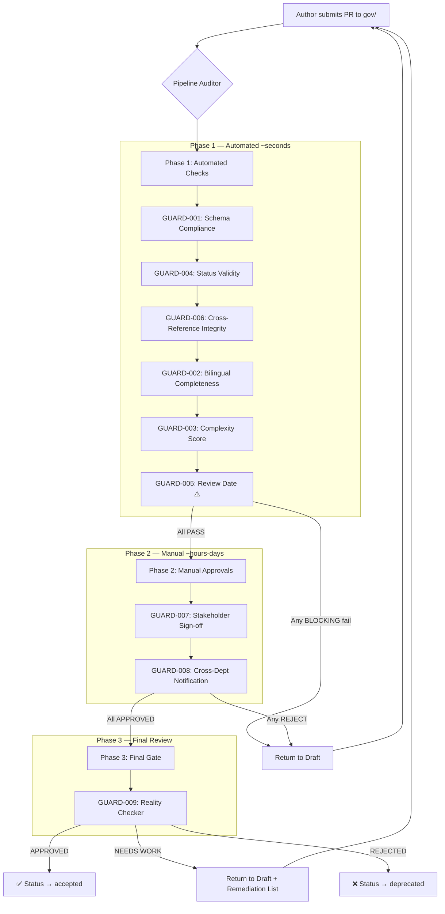

# 🛡️ SoloCorp OS — Verification Guards

> Quality gates สำหรับทุก Governance Artifact ในระบบ SoloCorp OS
> ก่อน ADR หรือ RFC ใดจะถูก **Accepted** ได้ ต้องผ่าน Guard Pipeline ทั้งหมด

---

## สารบัญ

- [ภาพรวม](#ภาพรวม)
- [Guard Types](#guard-types)
- [Pipeline Execution Flow](#pipeline-execution-flow)
- [Guard Reference](#guard-reference)
- [การเพิ่ม Guard ใหม่](#การเพิ่ม-guard-ใหม่)
- [Troubleshooting](#troubleshooting)
- [FAQ](#faq)

---

## ภาพรวม

Guard Pipeline คือ **automated + manual quality gate** ที่วางอยู่ระหว่าง `proposed → accepted` transition ของทุก governance artifact (ADR, RFC) ใน `gov/` directory

**หลักการออกแบบ:**

1. **Fail Fast** — Automated checks รันก่อน Manual Approvals ถ้า automated fail ไม่ต้องรอคน
2. **Progressive Trust** — ยิ่ง artifact ผ่าน guards มากเท่าไหร่ ยิ่งมั่นใจได้ว่ามีคุณภาพ
3. **Reality Checker เป็น Gate สุดท้าย** — ก่อน artifact จะถูก accept ต้องมีคนตรวจ viability จริง

---

## Guard Types

| Type | ใคร execute | ใช้เวลานาน | ผลลัพธ์ |
|:-----|:------------|:-----------|:--------|
| **automated** | Pipeline Auditor (CI bot) | ~seconds | PASS / FAIL |
| **manual** | Department Head / Orchestrator | hours–days | APPROVED / NEEDS WORK / REJECTED |

### Automated Guards (รันโดย Pipeline Auditor)

รันอัตโนมัติทุกครั้งที่มีการ push change ที่ `gov/` directory:

- ✅ **GUARD-001**: Schema Compliance — ตรวจ TOML structure
- ✅ **GUARD-002**: Bilingual Completeness — ตรวจ body.en + body.th
- ✅ **GUARD-003**: Complexity Score — ตรวจ score สอดคล้องกับ RFC-001
- ✅ **GUARD-004**: Status Validity — ตรวจ state machine transition
- ✅ **GUARD-005**: Review Date — ตรวจ expiry date (non-blocking warning)
- ✅ **GUARD-006**: Cross-Reference Integrity — ตรวจ broken links

### Manual Guards (ต้องมีคน approve)

ต้องการ human judgment:

- 👤 **GUARD-007**: Stakeholder Sign-off — Head แต่ละแผนก approve
- 👤 **GUARD-008**: Cross-Dept Notification — แจ้ง downstream departments
- 👤 **GUARD-009**: Reality Checker (Final Gate) — viability review สุดท้าย

---

## Pipeline Execution Flow



---

## Guard Reference

| ID | Name | Type | Severity | Failure Action |
|:---|:-----|:-----|:---------|:---------------|
| 001 | Schema Compliance | automated | 🛑 blocking | Block + field-level errors |
| 002 | Bilingual Completeness | automated | 🛑 blocking | Block + missing sections |
| 003 | Complexity Score | automated | 🛑 blocking | Block + require RFC-001 scoring |
| 004 | Status Validity | automated | 🛑 blocking | Block + illegal transition |
| 005 | Review Date | automated | ⚠️ warning | Flag + notify (non-blocking) |
| 006 | Cross-Reference Integrity | automated | 🛑 blocking | Block + broken links |
| 007 | Stakeholder Sign-off | manual | 🛑 blocking | Pending-approval state |
| 008 | Cross-Dept Notification | manual | 🛑 blocking | Proof of notification |
| 009 | Reality Checker | manual | 🛑 blocking | Final verdict |

### Severity Levels

| Severity | ความหมาย | การดำเนินการ |
|:---------|:---------|:-------------|
| 🛑 blocking | Status transition ถูกปิด | ต้องแก้ไขก่อน |
| ⚠️ warning | Transition ได้แต่ควรแก้ | Log + notify |

---

## การเพิ่ม Guard ใหม่

1. เพิ่ม entry ใน `[[guards]]` array ของ `default.toml`
2. ระบุ: `id`, `name`, `type`, `severity`, `description`, `checks`
3. ถ้า type = automated: ใส่ `failure_action`
4. ถ้า type = manual: ใส่ `approval_process` + `approval_required_from`
5. อัปเดต `execution.order` ใน default.toml
6. เพิ่ม reference ใน README นี้

### ตัวอย่าง Minimal Guard

```toml
[[guards]]
id = "GUARD-010"
name = "Spell Check (English)"
type = "automated"
severity = "warning"
description = "Basic spell check on body.en content"

checks = [
  "body.en decision/proposal text passes en_US spell check"
]

failure_action = "Flag as warning. Non-blocking."
```

---

## Troubleshooting

### Automated Guard Fail

```
❌ GUARD-001 FAILED: metadata.id is empty

Solution: Add id field to [metadata] section
```

**ปัญหาที่พบบ่อย:**

| Error | สาเหตุ | วิธีแก้ |
|:------|:-------|:--------|
| `metadata.id` missing | ลืมใส่ ID | เพิ่ม `id = "ADR-XXX"` |
| `body.th` empty section | ลืมเขียนไทย | เขียน body.th ให้ครบ |
| `footer.review_date` past due | review_date เกิน 90 วัน | อัปเดต review_date |

### Manual Guard Pending

```
⏳ GUARD-007 PENDING: Awaiting Head of Engineering sign-off

Solution: 
1. Check gov/audit/approval-log/ for who needs to sign
2. Contact the Department Head
3. Head approves via: `delegate_task` → Pipeline Auditor → sign-off
```

---

## FAQ

### Q: Guard fail แต่ฉันคิดว่าถูกต้องแล้ว?

เปิด Issue ที่ `gov/audit/disputes/` พร้อมหลักฐาน — Orchestrator จะ review ภายใน 48 ชม.

### Q: ข้าม Guard ได้ไหม?

ไม่ได้ การข้าม Guard Pipeline คือการ bypass governance SSoT ถ้าจำเป็นต้อง bypass จริงๆ (production incident) ให้ใช้ Incident Response Protocol และตามด้วย ADR ย้อนหลัง

### Q: Guard ใช้กับ artifact เก่าก่อน Phase 0 ได้ไหม?

แนะนำให้ migrate แบบ gradual — artifact ที่มีอยู่ก่อน Phase 0 ยังคงใช้ได้ แต่เมื่อมีการ modify ครั้งถัดไป ต้องผ่าน Guard Pipeline

### Q: ใครดูแล Guard Pipeline?

- **Pipeline Auditor** (ในทีม Architect) — รัน automated checks
- **Orchestrator (Architect)** — ตัดสิน borderline cases และ approve escalations
- **Reality Checker** — QA หรือ Architect specialist ที่ได้รับมอบหมาย

---

## Changelog

| Version | Date | Changes |
|:--------|:-----|:--------|
| 1.0.0 | 2026-07-05 | Initial release — 9 guards (6 automated + 3 manual) |

---

*Part of SoloCorp OS Phase 0: Governance Foundation*
*SSoT: `gov/guards/default.toml`*
