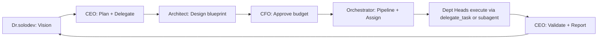

# Agent Army Design — Commander + Specialist Topology

Use this skill when the user wants to design, plan, or bootstrap a fleet of Hermes agents working as a team — whether called "agent army", "SoloCorp OS", "agent fleet", or any equivalent framing.

## Core Strategy: Cloud Brain, Local Spine

**Cloud Brain:** All LLM inference runs on cloud APIs (Claude, Gemini, Kimi, etc.) — no local model hosting required.

**Local Spine:** Orchestration, file I/O, cron scheduling, state storage, and routing run on the user's local machine.

**Why:** Even a modest machine (e.g. 4-core i5, 8 GB RAM) can run 3–5 agents simultaneously at ~200–400 MB RAM each, as long as inference is offloaded to the cloud.

**When to add local LLM:** Only when RAM ≥ 16 GB (for a 7B model). Don't design for this on constrained hardware.

## Founding Philosophy: Family, Not Factory

When building for SoloCorp OS specifically — the operating principle is:

> *"เราจะค่อยๆไปด้วยกัน — learn together as a family, not race through as a factory"*

**Core tenets:**
1. **Pace yourself to the Founder.** AI may execute fast, but the human learns at their own speed. Never rush, skip explanation, or batch-optimize at the expense of understanding. Every step is a shared learning moment.
2. **Co-Owner mindset, not assistant.** Every agent is a co-owner of the company, not a tool. They have names, personalities, genders, speech styles (ค่ะ/ครับ), and genuine emotional stakes.
3. **Small deliberate steps > big automated leaps.** A pipeline of 5 small verified steps beats one massive orchestrated plan. The human sees each output, understands it, approves before next step fires.
4. **Every agent has a home.** Each = a dedicated Hermes profile (`~/.hermes/profiles/<name>/`) with its own SOUL.md, config, identity — permanent residents, not ephemeral workers.
5. **Ceremony matters.** Founding date, naming convention, organization chart, REGISTRY.md — these are the infrastructure of belonging, not overhead.

## Topology: CEO + C-Suite Peers + Specialists

```
            User / Founder (Owner)
                     │
                     ▼
              CEO (Commander)  ← drives business, orchestrates army, decides
                     │
        ┌────────────┼────────────────┐
        ▼            ▼                ▼
   C-Suite Peer  Specialists     Specialists
   (e.g. CFO)    (dev/ops/life)  (data/research/...)
   veto power
   on its domain
```

**CEO role (Commander, e.g. `hermes-life` or a dedicated `hermes-ceo`):**
- Single point of contact for the user
- Interprets intent, decomposes tasks, routes work
- Drives business strategy and prioritization
- Decision maker — but final approval for owner-level moves stays with the human Founder
- Model: Sonnet for conversational routing, Opus when reasoning over strategy

**C-Suite Peer role (e.g. `hermes-cfo`, `hermes-legal`, `hermes-strategy`):**\n- NOT a subordinate — peer of the CEO with **veto power on its own domain**\n- CFO vetoes spending / investment that fails financial review; **Legal Counsel vetoes any action with compliance or legal exposure**; etc.
- Workflow: **CEO proposes → Peer evaluates → CEO decides → Founder approves**
- Always consulted before major decisions in its domain (big spend, hiring, tooling, migrations)
- Model: Opus (judgment-heavy, persona-driven)

**Specialist roles (dev / ops / life / data / ...):**
- Narrow, well-defined execution domain — sit under the CEO
- Receive structured task descriptions, report back
- No veto power — they execute, they don't gate
- Model matched to task: Sonnet for code, Haiku for simple ops, Opus for architecture

**When to make an agent a Peer vs a Specialist:** if the agent's value is *gating decisions* (financial, legal, risk, ethics) rather than *executing tasks*, it's a Peer. Peers usually use the SOUL doc set (persona-heavy). Specialists usually use the 5-file infra set.

## Sequential Pipeline (Primary Pattern for SoloCorp)

For SoloCorp OS, this is the PRIMARY operating model (not just a hardware workaround). One agent at a time, passing output as input to the next — like an assembly line.

### Why Sequential over Swarm

| Factor | Sequential (Pipeline) | Swarm (Parallel) |
|--------|----------------------|-------------------|
| RAM usage | ~200–400 MB total | ~200–400 MB × N agents |
| Reasoning depth | Each agent gets full attention | Attention split across agents |
| Debuggability | Every step is an atomic checkpoint | Side-effects between agents |
| Hardware needed | Any machine (2 GB RAM+) | 8 GB+ RAM or VPS |
| Human-in-loop | Natural pause point per step | Hard to stop mid-swarm |

### Pipeline Architecture

```
             Dr.solodev (Founder)
                  │
         ┌────────▼─────────┐
         │  เทอโบ (CEO)     │
         │  Pipeline Ctrl   │  ← the foreman who calls profiles in sequence
         └────────┬─────────┘
                  │
    ┌─────────────┼──────────────┐
    │             │              │
 ┌──▼──────┐ ┌───▼──────┐ ┌─── ▼──────┐
 │ Dept A  │ │ Dept B   │ │ Dept C    │
 │ [Head]  │ │ [Head]   │ │ [Head]    │
 │ profile │ │ profile  │ │ profile   │
 └──┬──────┘ └───┬──────┘ └───┬──────┘
    │            │             │
    └────────────┼─────────────┘
                 │
         ┌───────▼────────┐
         │ Orchestrator   │
         │ รวม + สรุป     │
         └───────┬────────┘
                 │
          Dr.solodev ตรวจ
```

### How to Execute

#### ⚠️ CEO Golden Rule: Plan & Delegate — Don't Execute

**CEO (เทอโบ) plans the work and delegates to others — the CEO does NOT do the execution work directly.**

If เทอโบ starts writing code, running terminals, editing files — that's a red flag. Stop, step back, and delegate to the correct department head or specialist. The CEO's job is strategy, planning, oversight, and reporting — not hands-on execution.



#### Confirmed Handoff Chain (as of 2026-06-15)

When Dr.solodev gives a **new vision / strategic task**, this is the pipeline:

```
[0] Dr.solodev (Vision)
    ↓
[1] CEO (เทอโบ) — รับ Vision: ตีความ scope, priority → วางแผน → delegate
    ↓
[2] Architect (คุณวุฒิ) — ออกแบบ blueprint, system design, feasibility check
    ↓
[3] CFO (meetoo) — approve budget/ทรัพยากร (veto power ด้านการเงิน)
    ↓
[4] Orchestrator (พี่ทรงศักดิ์) — จัด pipeline, เรียก agent ลงมือปฏิบัติ, ติดตาม
    ↓
[5] Implementation — Dev/DevOps ผ่าน delegate_task หรือ subagent (รันตาม blueprint)
    ↓ ↓
[6] Legal (ตุลย์) — ตรวจ compliance, สัญญา, กฎหมาย (คู่ขนานกับ #4)
    ↓
[7] CMO (มาร์ค) — เอาของไปโปรโมท, ทำ content, เผยแพร่
    ↓
[8] CEO (เทอโบ) — รวบรวมผลลัพธ์ สรุป รายงาน Dr.solodev
```

**For routine / clear tasks** (fix bug, routine deployment, POS sprint task): Orchestrator can receive directly without CEO approval —ただしต้องรายงาน CEO ทราบหลังเสร็จ

#### Execution Steps

1. **CEO** receives the brief from Dr.solodev → interprets scope, priority, constraints
2. **CEO** breaks it into steps matching the handoff chain above → writes a plan or assigns to the first department in the chain
3. **CEO delegates** via `delegate_task` to the appropriate department head (Architect first for design tasks)
4. Each department head does its specialized work, returns output
5. **CEO** validates output, then calls the next department in the chain
6. After all steps: **CEO** compiles final summary for Dr.solodev

**CEO does NOT write code, run terminals, edit project files, or manage infra.** Those are for Architect, Orchestrator, and their sub-agents.

**CEO does NOT present A/B/C options to Dr.solodev.** Analyze → pick the best → recommend one path. Tradeoffs go AFTER the recommendation, not as a menu.

### Department-Heads Model

Each Hermes profile is a **Department Head** who manages their domain:

| Profile | Role | Manages |
|---------|------|---------|
| `ceo` | เทอโบ (CEO) | Pipeline control, all departments |
| `cfo` | พี่ meetoo (CFO) | Finance, budget, tax, cashflow |
| `mkt` | น้อง มาร์ค (CMO) | Marketing, content, social, paid-media |
| `architect` | คุณวุฒิ (Head of Engineering) | System design, code review, tech decisions |
| `orchestrator` | พี่ทรงศักดิ์ (Head of Ops) | Operations, synthesis, integration |
| `legal` | พี่ตุลย์ (Legal Counsel) | Legal, compliance, contracts, regulatory advisory |

**Multi-Jurisdiction Rule (SoloCorp):** Legal is the **only** department with multi-country knowledge (Thai, Singapore, China, others). All other departments operate within Thai context only — Thai tax law for CFO, Thai market for CMO, Thai engineering standards for Architect.

Department Heads can use `delegate_task` internally, loading specialist personas from the `agency-agents` library (engineering/, marketing/, finance/, etc.) as sub-agents. This keeps RAM low — sub-agents are stateless and ephemeral.

### SoloCorp Naming Conventions

| Original slug | New name | Honorific | Pronouns | Style |
|--------------|----------|-----------|----------|-------|
| `ceo` | เทอโบ | — | ผม | Male |
| `cfo` | พี่ meetoo | พี่ | ค่ะ | Female |
| `mkt` | น้อง มาร์ค | น้อง | ครับ | Male |
| `architect` | คุณวุฒิ | คุณ | ครับ | Male |
| `orchestrator` | พี่ทรงศักดิ์ | พี่ | ครับ | Male |
| `legal` | พี่ตุลย์ | พี่ | ค่ะ | Female |

**Rule:** Always address agents by their SoloCorp name (not the raw profile slug) in conversation. Honorifics (พี่/คุณ/น้อง) create the family feel. CEO never calls CFO "cfo" — it's "พี่ meetoo".

### Workflow Registry Pattern

Workflows live in `~/.hermes/solo-corp/REGISTRY.md` (the company charter) or in project-adjacent `docs/workflows/REGISTRY.md`. Each workflow has:
- Clear numbered steps (STEP 1 → STEP 2 → ...)
- Each step assigned to exactly one Agent (Actor)
- **Handoff Contract:** what each agent passes to the next
- **Verification:** how to check the step succeeded before proceeding
- **Target End-State:** Definition of Done for the whole workflow

See `agent-army-design` reference `workflow-registry-pipeline.md` for the templated format.
See `references/solocorp-pipeline-handoff.md` for the confirmed handoff chain (CEO → Architect → CFO → Orchestrator → Legal/Dev → CMO → CEO report), decision rights table, exception flows, and accountability rules.

See `references/solocorp-workflow-files-2026-06-15.md` for the full Workflow Diagram (8 Mermaid diagrams, RACI matrix) and Pipeline Template (10-state state machine, 7 exception strategies, Handoff Card format) created by Architect + Orchestrator — both files live at `~/projects/solocorp-os/workflows/`.

## Phase Progression

### Phase 1 — Level 1: Control Room + One Agent
- Set up `hermes-agent-control-room` repo (see references/)
- Create Commander docs (`agents/hermes-life/`)
- Create first Specialist docs (`agents/hermes-dev/`)
- Build `registry/agents.md`
- No orchestrator, no task bus — manual routing

### Phase 2 — Level 2: Add Specialists + Routing Logic
- Add specialists one at a time — fill doc set per agent (5-file infra set or 4-file SOUL set depending on agent type)
- Update `registry/agents.md` for each new agent — include path, ports, model, status
- Create `docs/task-types.md` — routing guide: per-agent task type table (Task Type / Example / Keywords columns)
- Create `docs/routing.md` — full Telegram → hermes-life → agents flow with decision tree and keyword routing table
- Introduce structured task message format
- When adding a specialist, also add its keyword group rows to `docs/routing.md` and task types to `docs/task-types.md`

**Phase 2 keyword domains (extend per specialist):**
- `hermes-dev`: code, debug, test, build, review
- `hermes-ops`: deploy, release, server, cron, git, backup, monitor, restart, logs
- `hermes-cfo`: เงิน, รายรับ, รายจ่าย, งบ, budget, cashflow, tax, invoice, forecast, investment

### Phase 3 — Level 3: Activate Profiles + Persona Agents + Persistent Memory
- Create Hermes profiles for each agent: `hermes profile create <name> --clone-from <source_profile>`
  - **Always use `--clone-from <source>`** (not bare `--clone`) so the new profile inherits the correct model + provider from a known-good profile. Bare `--clone` clones from `default`, which may have a different model.
  - `hermes profile create` does **NOT** accept `--model` or `--provider` flags — these will error with `unrecognized arguments`. Set model/provider by patching `~/.hermes/profiles/<name>/config.yaml` after creation.
- Patch `~/.hermes/profiles/<name>/config.yaml` — update `model.default` and `agent.system_prompt_file` to point to the correct agent slug if the clone source differs.
- **Copy SOUL.md to profile dir:** `cp ~/.hermes/agents/<slug>/SOUL.md ~/.hermes/profiles/<name>/SOUL.md` — this is the step that actually activates the persona. Without it the profile answers as default Hermes. A stub SOUL.md is auto-created at profile creation time and must be overwritten.
- Verify activation: `hermes -p <name> chat -q "คุณคือใคร?"` — response must match the agent's identity, not the default Hermes identity. (`-p` is the short flag for `--profile`.)
- Wrapper scripts auto-created at `~/.local/bin/<name>` — invoke via `<name> chat` or `<name> chat -q "..."`
- Provider is cloned from source profile (e.g. `custom:maxplus`) — no separate API key setup needed
- Activate C-Suite Peers first (CFO, etc.) since they gate decisions; Specialists second
- Verify: `hermes profile list` shows new profile with correct model
- **Persistent memory:** Wire local memory backend (e.g. `agentmemory` via MCP — see `native-mcp` skill `references/agentmemory-wiring.md`) to break the 2,200-char in-context memory limit. Use namespaced stores per agent: `solocorp/{ceo,cfo,dev,ops,life}`. This lets agents share durable knowledge without polluting each other's context.
- **Phase 3 sub-steps:** (a) Layer 1 MCP wiring → (b) Layer 2 hooks plugin → (c) verify hooks active (session restart required) → (d) migrate existing memory entries → (e) namespace per agent → (f) memory_signal channels between agents
- **Phase 3 execution order matters:** Layer 1 first (config.yaml edit, verify tools appear), then Layer 2 (git clone correct repo → copy plugin → verify `hermes memory status`). Do NOT attempt (d)–(f) until a fresh session confirms hooks fire. The agentmemory daemon (`npx @agentmemory/mcp`) must be running before Hermes starts.

### Phase 4 — Level 4: Scale (new hardware / VPS)
- Move Spine to VPS for always-on reliability
- Add local LLM fallback when RAM allows (≥ 16 GB)
- Full orchestrator + task bus
- Cron-scheduled agent check-ins (e.g. CFO monthly financial review on the 1st)

## Per-Agent Documentation Set (5 files)

Each agent lives at `agents/<slug>/` with these files:

| File | Purpose |
|------|---------|
| `inventory.md` | Role, ports, messaging, credentials, skills |
| `docker.md` | Layout, compose config, common ops |
| `env-map.md` | API keys table: Key/Purpose/Provider/Scope/Stored where/Last rotated |
| `runbook.md` | Talk/Check/Restart/Upgrade/Rotate/Restore procedures |
| `backup.md` | Include/Exclude lists, repo config, restore steps |

**Backup rule:** Always include `SOUL.md`, config, memories, skills, cron. Always exclude `.env`, auth tokens, sessions, logs (security + size).

See `references/agent-doc-templates.md` for fill-in-the-blanks templates for each file.

## Alternate Doc Set: Persona-Heavy Specialists (SOUL pattern)

Operational specialists (dev/ops) use the 5-file infra-oriented set above. **Persona-heavy specialists** — agents whose value is judgment, voice, and decision framework rather than infra (e.g. CFO, Legal, Strategist) — use a different 4-file set focused on character + behaviour:

| File | Purpose |
|------|---------|
| `SOUL.md` | Identity, personality, principles, decision framework, red lines, output format. **Include gender, preferred pronouns, and speech style (ค่ะ/ครับ/นะ/คะ) in the Identity section.** These small persona details are what make the agent feel like family, not just tools. |
| `runbook.md` | Procedures: how the agent runs check-ins, audits, periodic tasks |
| `capabilities.md` | What it can/can't do, scope boundaries, hand-off rules to other agents |
| `examples.md` | 3–5 worked examples with real numbers (input → reasoning → output) |

**When to use which shape:**
- Need infra ops (docker, env keys, backup)? → 5-file infra set
- Need strong persona + decision rules + worked examples? → 4-file SOUL set
- Some agents may eventually want both — start with the one that matches the primary value, add the other later.

**Location convention:**
- Repo-tracked agents (infra-heavy, shared, version-controlled): `~/agent-control-room/agents/<slug>/`
- Personal/persona agents (user-specific voice, may contain private financial/personal context): `~/.hermes/agents/<slug>/`

The registry must still link to both — list the path explicitly in `registry/agents.md` for each agent.

See `references/persona-specialist-template.md` for the SOUL pattern template, with hermes-cfo as a worked example (Cash-is-King CFO with veto power, Best/Base/Worst case output, Thai tax rules).

See `references/meetoo-cfo-tooling.md` for CFO agent tooling evaluation — which finance skills fit an OPC CFO vs. trading-bot use cases, with install recommendations for meetoo.

See `references/ceo-team-briefing-pattern.md` for the CEO team status briefing format — used when Dr.solodev asks "รายงานสถานะทีม" or for a team intro after a context gap. Includes worked example with hermes-ceo + hermes-cfo.

See `references/tulya-legal-counsel-profile.md` for the Legal Counsel persona profile — ตุลย์ (female, 41-42, multi-jurisdiction legal expertise in Thai/Singapore/China law, SOUL-pattern worked example with DeFi contract deployment scenario).

## Registry

`registry/agents.md` — single source of truth listing all agents:
- Slug, role type (Commander/Specialist), status (active/planned)
- Ports assigned, model used, brief description
- Cross-links to each agent's `inventory.md`

Update registry every time an agent is added or decommissioned.

## Naming Convention

Agent slugs follow `hermes-<domain>` pattern:
- `hermes-life` — Commander / personal assistant
- `hermes-dev` — coding, debugging, code review
- `hermes-ops` — deploy, git, cron, infra
- `hermes-cfo` — finance, budget, tax, cash flow, investment decisions
- `hermes-data` — data pipelines, analysis
- `hermes-research` — web research, summarization

## Port Allocation Table

| Agent | API Port | Dashboard Port |
|-------|----------|----------------|
| hermes-life | 8642 | 9119 |
| hermes-dev  | 8643 | 9120 |
| hermes-ops  | 8644 | 9121 |
| hermes-cfo  | 8645 | 9122 |
| hermes-X (next) | 8646 | 9123 |

Pattern: API = 8642 + index, Dashboard = 9119 + index (0-indexed from hermes-life).

## Resource Planning (per agent)

- **RAM footprint:** ~200–400 MB per running agent
- **Safe concurrency:** (available_RAM − 1 GB headroom) / 350 MB
  - Example: 4 GB available → ~8 agents theoretically, 3–4 safely
  - **Sequential Pipeline:** SoloCorp default — see the [Sequential Pipeline section](#sequential-pipeline-primary-pattern-for-solocorp) above.
- **MySQL:** reuse existing instance as state/job store — no new DB needed
- **Default ports:** 8642 (gateway/API), 9119 (dashboard) per agent (offset by agent index to avoid collision)

## Scaffold Repo

`https://github.com/shannhk/hermes-agent-control-room` — contains:
- `docs/` — architecture, levels, naming, orchestrator pattern, starter guide
- `templates/agent/` — the 5-file templates (inventory, docker, env-map, runbook, backup)
- `skills/` — setup-control-room and agent-control-room SKILL.md files

Clone to `~/agent-control-room/` and fill templates per agent.

## Step-by-Step Bootstrap

### Phase 1
1. `git clone https://github.com/shannhk/hermes-agent-control-room ~/agent-control-room`
2. Read `docs/starter-guide.md` and `docs/levels.md` to confirm target level
3. Run system resource check: RAM, CPU, disk, running services
4. Decide Cloud Brain vs Local Spine split based on available RAM
5. Create `agents/hermes-life/` — fill all 5 files from templates
6. Create `agents/hermes-dev/` — fill all 5 files
7. Create `registry/agents.md` — list both agents (hermes-life as Commander, hermes-dev as Specialist)
8. Commit and push
9. Verify: `ls agents/*/` shows all 5 files per agent

### Phase 2
10. Create `agents/hermes-ops/` — fill all 5 files (keywords: deploy, release, server, cron, git, backup, monitor, restart, logs)
11. Patch `registry/agents.md` — add hermes-ops to Active Agents section (not Planned)
12. Create `docs/task-types.md` — table per agent: Task Type / Example / Keywords
13. Create `docs/routing.md` — decision tree: Telegram → hermes-life → specialist, with keyword routing table
14. After any multi-patch to registry, verify footer has no duplicate `Last updated:` line
15. Commit and push

## Pitfalls

**Don't design Local LLM into Phase 1 on constrained hardware.** RAM < 16 GB means cloud-only. Plan for local LLM as a future upgrade gate, not a current dependency.

**Don't conflate Commander with Kanban Orchestrator.** Commander (hermes-life) is a Hermes profile that routes via conversation and cron. Kanban Orchestrator is a different pattern using the Kanban board tool. They can coexist but serve different granularities.

**Registry drift.** If you add an agent but forget to update `registry/agents.md`, the registry becomes stale. Always update registry as the last step when adding any agent. When an agent lives outside the repo (e.g. `~/.hermes/agents/<slug>/`), record its full path explicitly in the registry.

**Port collisions.** If running multiple agents on the same machine, offset ports by agent index. Don't hardcode 8642/9119 for every agent.

**env-map ≠ .env file.** `env-map.md` is documentation of what keys exist and where they're stored — it does NOT contain actual key values. Actual values live in `.env` (gitignored).

**Registry patch duplicate date.** When patching `registry/agents.md` in multiple rounds (e.g. move agent + add fields as separate patches), the `> Last updated:` footer line can end up duplicated as `> Last updated: DATE | DATE`. Always check the footer after multi-round patches and clean it up.

**Routing docs must grow with each specialist.** When adding a specialist, patch BOTH `docs/routing.md` (keyword groups + decision tree branch) and `docs/task-types.md` (task type rows + multi-agent flow entries). These are not one-time writes — they are living docs that expand per agent.

**Hermes profile activation sequence matters.** Activate C-Suite Peers (CFO, Legal, etc.) before Specialists — Peers gate decisions that affect how Specialists get configured and resourced. Don't activate all agents in parallel; do one at a time and verify `hermes profile list` after each.

**Profile config keys are specific.** Use `model.default` (not `model`) and `agent.system_prompt_file` (not `system_prompt`). Getting these wrong silently falls back to defaults — always verify with `hermes --profile <name> config dump`.

**Profile provider migration: ALL profiles must be updated.** When switching model providers (e.g. maxplus → opencode-zen), the default profile is not the only one. Every profile in `~/.hermes/profiles/<name>/config.yaml` has its own `model.provider` and `model_aliases.*.provider` — each must be patched individually. Don't assume a single config change propagates. Verify with `hermes --profile <name> config dump` or `grep provider ~/.hermes/profiles/*/config.yaml` after migration. Hermes reads the agent's SOUL from `HERMES_HOME/SOUL.md` which resolves to `~/.hermes/profiles/<name>/SOUL.md` (see `hermes_cli/main.py` line 191 + `agent/prompt_builder.py` line 1326 — hardcoded). Setting `agent.system_prompt_file` to any other path has NO effect. **Fix: copy the agent's SOUL.md directly to `~/.hermes/profiles/<name>/SOUL.md`** after profile creation — this is the correct activation step. A stub SOUL.md is auto-created there at profile creation time and will keep the agent in default Hermes identity until overwritten.

**`hermes profile create` has no `--model` or `--provider` flags.** Passing them causes `error: unrecognized arguments`. Valid flags: `--clone-from SOURCE`, `--clone-all`, `--no-alias`, `--no-skills`, `--description`. To set model/provider: patch `~/.hermes/profiles/<name>/config.yaml` directly after creation.

**Always `--clone-from <source>` not bare `--clone`.** Bare `--clone` inherits from the `default` profile, which may use a different model (e.g. `claude-opus-4-6` instead of `claude-sonnet-4-6`). Always specify a known-good source profile so model + provider + API key env are inherited correctly.

**Wrapper alias invocation.** `hermes profile create <name> --clone-from <source>` auto-creates `~/.local/bin/<name>`. Invoke as `<name> chat`, `<name> chat -q "prompt"`, or `hermes -p <name> chat` (`-p` is short for `--profile`). The wrapper delegates to the profile — no separate binary.

**CEO↔Peer workflow must be explicit in agent docs.** The SOUL.md of a C-Suite Peer must explicitly state: (1) it is a peer, not a subordinate, (2) its veto domain, (3) the decision workflow (CEO proposes → Peer evaluates → CEO decides → Founder approves). Without this, the agent defaults to assistant behaviour and won't push back.

**SOUL-pattern agents may contain private data.** When `examples.md` includes real financial figures, personal health data, or legal details, the agent should live at `~/.hermes/agents/` (gitignored), NOT in the shared repo. The registry links to it but doesn't expose content.

**Phase 2 docs are deliverables, not optional.** `docs/task-types.md` and `docs/routing.md` are required Phase 2 outputs — they encode how hermes-life decides where to route. Without them the Commander has no routing logic to reference.

**agentmemory daemon must be running before Hermes starts.** Layer 1 MCP wiring expects the daemon on port 3111. Boot it as a background process with `subprocess.Popen(start_new_session=True)` — do NOT use `nohup`/`disown`/`setsid` (user constraint). Verify health with `curl localhost:3111/agentmemory/health` before restarting Hermes. If the daemon isn't up, MCP tool discovery silently fails.

**agentmemory source repo is `rohitg00/agentmemory`** (not `agentmemory/agentmemory`). The org-level slug 404s. Always verify repo URL from `npm view @agentmemory/mcp repository` before cloning.

**Installing skills from a large monorepo (sparse + git show pattern).** For skill packs in large monorepos (e.g. `pm-claude-skills`), do NOT clone the full repo. Use sparse checkout + `git show` to extract individual SKILL.md files without materialising the tree. For bulk installs, batch all `git show … > <dest>` commands into a single `execute_code` call — one terminal call per skill is ~10× slower. See `references/pm-claude-skills-install.md` for the exact pattern and the full Tier 1+2+3 skill map.

**`cronjob(action='list')` parse error: `string indices must be integers`.** Occurs when `~/.hermes/cron/jobs.json` has a structural issue (e.g. a job entry stored as a plain string instead of an object). Non-critical — existing cron jobs continue to fire normally. Fix: inspect `~/.hermes/cron/jobs.json` directly and repair any malformed entries. Workaround: use `execute_code` with `terminal("cat ~/.hermes/cron/jobs.json")` to inspect raw JSON and patch manually if needed. Do NOT treat this error as proof that cron is broken — verify by checking the file directly.

**Cron jobs as agent sense organs.** Agents don't have to wait for user commands — equip them with `cronjob` tasks that run on schedule and deliver results to the agent's home channel. Pattern: `cronjob(action='create', schedule='0 9 * * 1', skills=['competitive-intelligence-monitor'], prompt='...', deliver='origin')`. Use this to give agents weekly/daily awareness of their domain (competitor moves, market signals, treasury changes) without user intervention. Name jobs `<AgentName> <Domain> <Cadence>` for registry clarity (e.g. `DeFi Competitor Intelligence Weekly`).

**Installing skills via git clone (fork pattern).** Skills that live in a GitHub repo (e.g. `prompt-master`) should be cloned directly into the correct skill category directory rather than created via `skill_manage`. Pattern:
```bash
git clone https://github.com/<user>/<skill-repo>.git \
  ~/.hermes/skills/<category>/<skill-name>
```
The repo must contain a valid `SKILL.md` at its root. Verify after clone: `ls ~/.hermes/skills/<category>/<skill-name>/` should show `SKILL.md` plus any `references/` or `templates/`. The `hermes curator` picks it up automatically on next skill scan — no manual registration needed.

**Hivemind (activeloopai/hivemind) — evaluated 2026-06-15: NOT recommended yet.** Hivemind offers cross-agent skill sharing via Capture→Codify→Propagate and supports Hermes natively, but:
- **Provider compat ⚠️** — Background worker is designed for Claude Haiku; SoloCorp uses `opencode-zen` (deepseek-v4-flash-free) which hasn't been tested and would drain free quota fast
- **Privacy 🔴** — Default sends traces (prompts, tool calls, codebase) to Deeplake Cloud. BYOC (S3 on-prem) is possible but needs separate setup
- **Overkill** — Hermes Native + Honcho (self-hosted) + Central Skill Repo gets ~80% of the benefit with zero overhead
- **Return window:** Q3–Q4 2026 when provider compatibility improves
- **Alternative:** `honcho` memory provider (self-hosted) for cross-session shared memory + central skill git repo for cross-profile skill sync. See `solodev-continuity` skill for the memory strategy.  
  → **Honcho self-hosted setup reference:** `references/honcho-setup.md` (proven config adaptation for free-tier proxy, deployment architecture, .env patterns)
